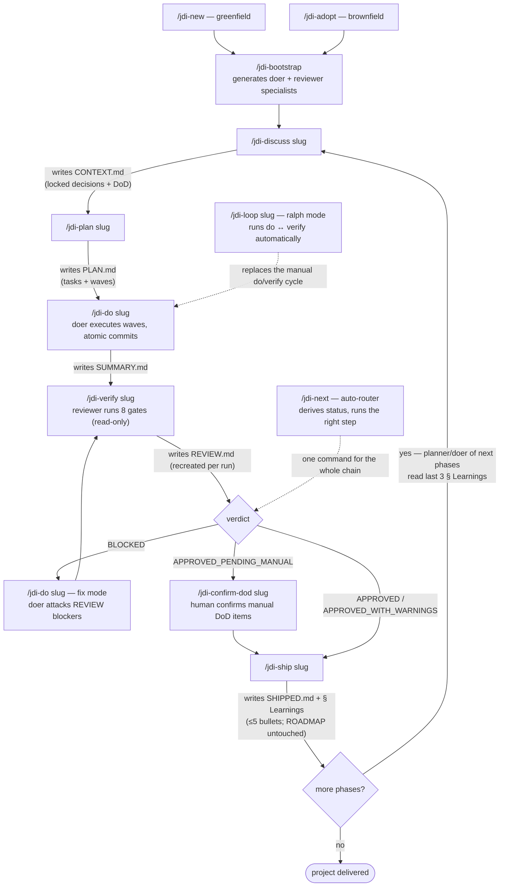
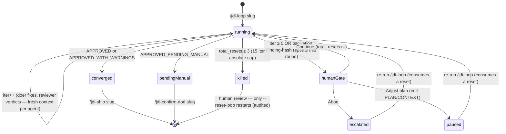
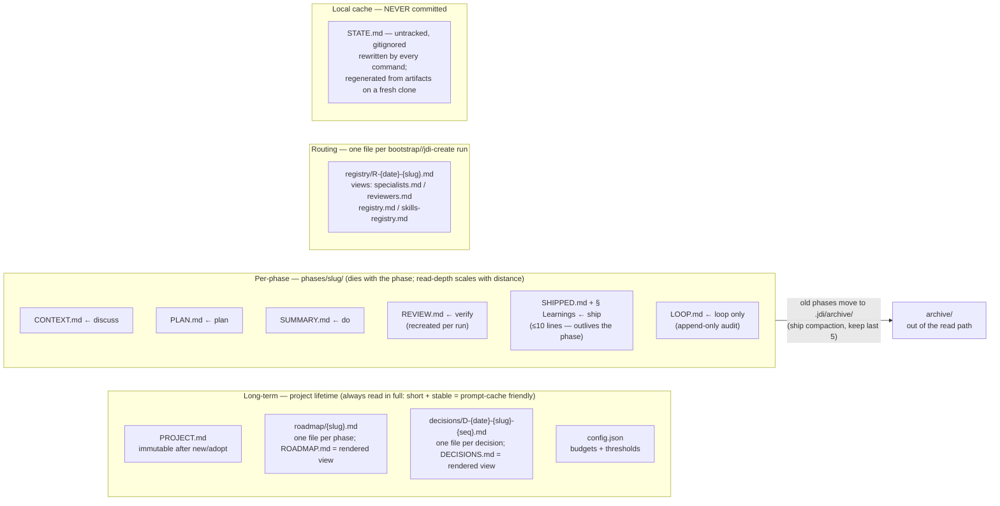
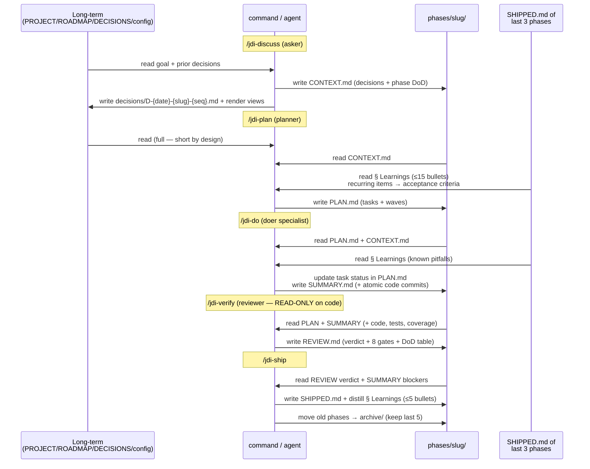

# JDI — Just Do It

```
       ██╗██████╗ ██╗
       ██║██╔══██╗██║
       ██║██║  ██║██║
  ██   ██║██║  ██║██║
  ╚█████╔╝██████╔╝██║
   ╚════╝ ╚═════╝ ╚═╝

  ◄══════════════════════════════════════════════|=|◉|=|/////|==
  ◄══════════════════════════════════════════════|=|◉|=|/////|==
  ◄══════════════════════════════════════════════|=|◉|=|/////|==

  Cut through the chaos. Ship the work. [Just do it]
```

Lean workflow toolkit for developers (solo or team) + AI assistant. Adaptive loop, atomic commits, file-based state, fresh context per agent, wave-based parallelism, zero merge conflicts in shared state. Per-project specialists that already know your stack.

## Why

Full-blown AI workflows (33+ agents, 60+ commands, 100+ subworkflows) burn tokens and ceremony. JDI ships what matters and cuts the rest:

- **7 core agents** + **2 per-project** (doer + reviewer, generated by `/jdi-bootstrap`)
- **17 commands** — `/jdi-issue` autonomous card intake + `/jdi-next` auto-router + 7-step main loop + DoD confirmation + brownfield entry + ralph mode + status (+ `--stats` outcomes) + 2 roadmap mutation + migration + meta
- **File-based state** in `.jdi/` (Markdown + frontmatter, no DB) — merge-conflict-free for teams by construction
- **Multi-runtime:** Claude Code, GitHub Copilot, Google Antigravity, OpenCode, JetBrains Junie
- **Zero runtime deps** — Node stdlib only
- **Brownfield supported** — adopt existing projects, not just greenfield
- **Multi-stack** — N specialist pairs with file-glob routing (e.g. backend C# + frontend React)
- **Optional MCP** — one-shot Playwright MCP install across Claude/OpenCode/Copilot/Antigravity (Junie: manual MCP config)

## When NOT to use JDI

Honest scope. JDI pays off when the project lives long enough for structure to compound — phases, locked decisions, learnings, a reviewer that blocks. It does NOT pay off for:

- **Throwaway prototypes / weekend scripts** — the ceremony (discuss → plan → do → verify → ship) costs more than the error it prevents. Talk to your agent directly; that is the honest tool there.
- **Pure exploration** — when you don't know what you're building yet, specs and DoD are guesses. Explore first, `/jdi-adopt` later if it survives.
- **Single-file fixes in repos you don't own** — a drive-by PR doesn't need a roadmap.

Rule of thumb: **cost of an error × how long the code will live**. Low on both → skip JDI. High on either → the gates earn their keep.

## Quickstart — `npx` in 30 seconds

```bash
cd /path/to/your/project
npx jdi-cli@latest install opencode
```

Done. Swap `opencode` for `claude`, `copilot`, `antigravity`, or `all` depending on your active runtime.

> No `cd` first? `npx` runs in the current directory. Always confirm with `pwd` (Linux/Mac) or `Get-Location` (Windows).

### Prerequisites

- **Node.js 18+** (for `npx`)
- **git**
- At least one runtime: Claude Code, GitHub Copilot, Antigravity, or OpenCode

## The flow

Every phase command accepts either a **slug** (`auth-flow`, canonical) or an integer **position** (`2`, display ordering). Slugs are stable across branch merges; positions are not. New phases default to slug-as-ID; legacy `NN-slug` projects keep working until you opt into `/jdi-migrate-phases`.

**Don't want to memorize the sequence?** Run `/jdi-next` repeatedly — it derives where the phase is from its artifacts and executes the correct next step (including fix-after-BLOCKED and confirm-dod routing). One command to remember; the ones below remain for fine control.

Each command writes ONE artifact into the phase folder — the artifact IS the gate to the next command, and the phase status is derived from whichever artifacts exist (nothing is ever stored as "status"):



Anytime: `/jdi-next` (auto-route to the next step), `/jdi-status` (read-only snapshot; `--stats` adds outcome metrics), `/jdi-add-phase` / `/jdi-remove-phase` (roadmap mutation, team-safe).

**Fully autonomous intake:** `/jdi-issue <github-url | tracker-id | card text>` — card → PR with no human in the chain. Rigor compensates the missing human: DoD critic forced on, warnings get a fix round, hard iteration fuses, human-only criteria land in the PR body as "Deferred to PR review"; killed loops never ship, and JDI never merges the PR. Trigger it from CI/webhooks for proactive work — the runtime is the executor, JDI stays daemon-free.

### Greenfield (new project)

```
/jdi-next                                  <- or run each step yourself:

/jdi-new "<short description>" [--auto]    <- research + PROJECT.md + ROADMAP.md (--auto: zero questions, researcher decides + records rationale)
/jdi-bootstrap                             <- doer + reviewer per project
/jdi-discuss <slug|position>               <- capture locked decisions (CONTEXT.md)
/jdi-plan    <slug|position>               <- decompose into tasks + waves (PLAN.md)
/jdi-do      <slug|position>               <- execute via doer specialist (SUMMARY.md)
/jdi-verify  <slug|position>               <- gates via reviewer (REVIEW.md, recreated per run)
/jdi-confirm-dod <slug|position>           <- only if verdict is APPROVED_PENDING_MANUAL (manual DoD items)
/jdi-ship    <slug|position> [--pr]        <- write SHIPPED.md marker (+ open PR via gh with --pr)

# Roadmap mutation (run anytime, multi-developer safe)
/jdi-add-phase "<name>" [--slug s] [--before <slug>|--after <slug>]
/jdi-remove-phase <slug|position> [--force]

# v0/v1 → v2 migration (one-time, non-destructive)
/jdi-migrate-phases [--dry-run]            <- stamps schema_version: 2 in STATE.md

# Continuity / where did I stop?
/jdi-status [--stats]                      <- compact snapshot: phase + last action + next step
```

### Brownfield (existing project)

```
/jdi-adopt                                 <- scan repo, infer stack/code-design, confirm with user
/jdi-bootstrap                             <- doer + reviewer (adopted-aware: coverage only on new files)
/jdi-discuss <slug|position>               <- ... same as greenfield from here
/jdi-plan    <slug|position>
/jdi-do      <slug|position>
/jdi-verify  <slug|position>
/jdi-ship    <slug|position>
```

`/jdi-adopt` detects manifests (`package.json`, `pyproject.toml`, `go.mod`, `Cargo.toml`, `*.csproj`, `pom.xml`), infers layout (DDD / Vertical Slice / Clean / Hexagonal / The Method / legacy-mixed), reads `README.md` for vision hint, captures existing assets, and ALWAYS confirms code-design with you before locking (D-1). Records boundary commit hash in D-2 so reviewer enforces coverage only on files created AFTER adoption.

### Ralph mode (auto-iterate)

Instead of manually running `/jdi-do` then `/jdi-verify`, use:

```
/jdi-loop <slug|position>
```

Runs `/jdi-do` ↔ `/jdi-verify` in a bounded loop (default 5 iter per round, max 3 resets = 15 iter absolute). Exits when verdict is `APPROVED` or `APPROVED_WITH_WARNINGS`; a verdict of `APPROVED_PENDING_MANUAL` exits cleanly routing to `/jdi-confirm-dod` (the loop cannot confirm manual DoD items). Oscillation detection (finding-hash compare across the current round) cuts dead loops early. Resuming an `escalated`/`paused` loop consumes a reset; a `killed` loop is final unless you pass `--reset-loop` (confirmed, audited).

Every iteration appends one line to `phases/<slug>/LOOP.md` (append-only audit trail); the frontmatter tracks `iter`, `total_resets`, `status`:



## State model — `.jdi/`

```
your-project/
├── .jdi/                          # state files (generated by JDI commands)
│   ├── PROJECT.md                 # vision, stack, code-design, § Definition of Done (LOCKED after /jdi-new or /jdi-adopt)
│   ├── config.json                # token/context budget, thresholds, compaction, orchestration mode
│   ├── VERSION                    # JDI version installed
│   ├── roadmap/                   # SOURCE OF TRUTH (layout v3): one file per phase — _header.md + {slug}.md (order: frontmatter)
│   ├── decisions/                 # SOURCE OF TRUTH: one file per decision — D-{date}-{slug}-{seq}.md (filename = ID) + LEGACY.md
│   ├── todos/                     # SOURCE OF TRUTH: one file per todo batch — {date}-{slug}.md + LEGACY.md
│   ├── registry/                  # SOURCE OF TRUTH: one file per bootstrap//jdi-create — R-{date}-{slug}.md + LEGACY*.md
│   ├── ROADMAP.md                 # RENDERED VIEW of roadmap/ (untracked; legacy format — NO status, NO current pointer)
│   ├── DECISIONS.md               # RENDERED VIEW of decisions/ (untracked)
│   ├── todos.md                   # RENDERED VIEW of todos/ (untracked)
│   ├── specialists.md             # RENDERED VIEW of registry/ (untracked) — plus reviewers.md, registry.md, skills-registry.md
│   ├── STATE.md                   # ADVISORY next-step cache — untracked/gitignored; regenerated from artifacts when absent
│   ├── agents/                    # per-project specialists
│   │   ├── jdi-doer-{slug}.md
│   │   └── jdi-reviewer-{slug}.md
│   ├── phases/
│   │   ├── <slug>/                # v2 layout (default for new projects)
│   │   │   ├── CONTEXT.md         # from /jdi-discuss
│   │   │   ├── PLAN.md            # from /jdi-plan
│   │   │   ├── SUMMARY.md         # from /jdi-do
│   │   │   ├── REVIEW.md          # from /jdi-verify (verdict + DoD Checklist; recreated per run)
│   │   │   ├── SHIPPED.md         # from /jdi-ship (completion marker — this is what makes a phase "done")
│   │   │   └── LOOP.md            # only if /jdi-loop ran (ralph state)
│   │   └── NN-<slug>/             # v1 legacy layout — NEVER renamed (preserves git history)
│   ├── archive/                   # old phases moved here by ship compaction (default: keep last 5 active)
│   └── cache/                     # gitignored — gate 7 artifacts (screenshots, JSON findings)
├── .claude/                       # (if runtime=claude)
│   ├── agents/jdi-*.md
│   ├── commands/jdi-*.md
│   └── settings.example.json
├── .githooks/                     # only if installed with --githooks (opt-in, no-op scripts)
├── .gitattributes                 # EOL normalization only — v3 needs no merge drivers (see Team usage)
├── CLAUDE.md                      # runtime instructions
└── {your code}
```

For other runtimes, swap `.claude/` for `.github/`, `.agents/` (Antigravity 2.0), or `.opencode/`. See [PORTABILITY.md](PORTABILITY.md).

### Memory layers — who writes what, and for how long

`.jdi/` is layered memory. Each layer has a different lifespan and a single writer — that is what makes it merge-safe and cheap to read:



**Read-depth ladder (token economy):** current phase = full body · previous phase = frontmatter + verdict only · 2+ back = never read (only `ls`/`head`) · exception: `§ Learnings` of the last 3 SHIPPED.md (≤10 lines each). Long-term files are always read whole — they are short by design and stable, so they hit the prompt cache.

### When memory is written and read (one phase, end to end)

Solid arrows = writes. Every command also rewrites the local `STATE.md` cache (not shown — untracked, advisory only):



The cycle: what a phase LEARNS (warnings, blockers, waivers) survives as ≤5 distilled bullets that the NEXT phases' planner and doer consume — ~300 tokens instead of dragging whole REVIEW files forward. Full schema: [MEMORY.md](MEMORY.md).

### Invariants

- `PROJECT.md` is **immutable** after `/jdi-new` or `/jdi-adopt`
- **Decisions are write-once files.** Locked decisions never reverse — and the reviewer verifies it: Gate 6 BLOCKS a diff that contradicts a locked decision. Layout v3 stores one file per decision (`decisions/D-YYYY-MM-DD-slug-seq.md`, filename = ID, collision-free across branches; genesis decisions keep `D-1` code design / `D-2` adoption boundary); the `DECISIONS.md` view is regenerated, never edited. Legacy projects keep appending to `DECISIONS.md` until migrated
- **The registry is write-once files** — one `registry/R-{date}-{slug}.md` per bootstrap//jdi-create run; `registry.md` and the routing tables are rendered views
- **Phase status is derived from artifacts, never stored**: `SHIPPED.md` → done, `REVIEW.md` → verified, `SUMMARY.md` → executed, `PLAN.md` → planned, `CONTEXT.md` → discussed, nothing → pending. ROADMAP.md carries no per-phase status and no current-phase pointer; STATE.md is an advisory hint only
- **Phase slugs never change.** Existing `NN-slug/` folders are never renamed on migration. Numeric positions (`### Phase 3`) are display-only and may renumber on insert/remove
- Every command is **idempotent** — re-running prompts before overwrite
- Reviewer is **read-only by design** (no Write/Edit). Doer is the only writer

## Gates between commands

| From | To | Gate |
|---|---|---|
| `/jdi-bootstrap` | `/jdi-discuss` | doer + reviewer specialists exist in `.jdi/agents/` (enforced) |
| `/jdi-discuss` | `/jdi-plan` | `CONTEXT.md` exists (with `## Definition of Done`) |
| `/jdi-plan` | `/jdi-do` | PLAN valid (every task has `files_modified`, `acceptance`, `dependencies`, `test`, `specialist`) |
| `/jdi-do` | `/jdi-verify` | `SUMMARY.md` exists |
| `/jdi-verify` | `/jdi-confirm-dod` | verdict == `APPROVED_PENDING_MANUAL` (manual DoD items pending) |
| `/jdi-verify` | `/jdi-ship` | verdict ∉ {`BLOCKED`, `APPROVED_PENDING_MANUAL`} + zero `MANUAL_REQUIRED` rows left in the DoD Checklist + `SHIPPED.md` absent |

## Team usage

`.jdi/` is committed to git — it IS the shared state. What that buys a team:

- **One bootstrap serves the team.** Specialists generated in `.jdi/agents/` are shared through the repo; a teammate cloning the project gets the doer + reviewer for free.
- **Slugs are the stable identity of phases across branches.** Positions renumber; slugs never do. All artifacts, commit scopes, and decision IDs key off the slug.
- **ROADMAP without status = zero merge conflicts at ship.** `/jdi-ship` writes `phases/<slug>/SHIPPED.md` instead of editing ROADMAP.md — two developers shipping different phases on different branches touch disjoint files.
- **Status is derived, never stored.** Any clone answers "where is phase X?" from artifacts alone: `SHIPPED.md` → done, `REVIEW.md` → verified, `SUMMARY.md` → executed, `PLAN.md` → planned, `CONTEXT.md` → discussed, nothing → pending.
- **STATE.md is a local cache, never versioned (0.3.0+).** Every command rewrites it, so committing it guaranteed a conflict on every merge — it now lives in `.gitignore` and commands regenerate it from artifacts on a fresh clone. Existing projects: `git rm --cached .jdi/STATE.md && echo '.jdi/STATE.md' >> .gitignore`.
- **Multi-writer streams are one-file-per-entry (layout v3, 0.13.0+).** Decisions, todos, roadmap entries and registry rows each live in their own file — two branches write two different files, and different files can never conflict. See the next section for why `merge=union` was NOT enough.
- **DECISIONS v2 IDs are collision-free — and are the filename.** `D-{YYYY-MM-DD}-{slug}-{seq}` — two devs locking decisions on different phases the same day never collide. Registry entries follow the same scheme: `R-{YYYY-MM-DD}-{slug}`.
- **Learnings travel between phases.** `/jdi-ship` distills the review's warnings/blockers into ≤5 bullets in `SHIPPED.md § Learnings`; the planner and doer of later phases read the last 3 and turn recurring items into acceptance criteria — recurring failures stop recurring.
- **Recommended: one phase per branch/dev.** Each phase's files live under its own `phases/<slug>/` folder, so merging `.jdi/` is trivial — per-phase files are disjoint by construction. Same-slug collisions surface as an explicit git conflict, not a silent overwrite.
- **Recommended: put your `test_command` in CI.** JDI's gates are agent-run; a CI job running the PROJECT.md test command (+ coverage) is the deterministic backstop no agent can skip.

### Conflict-free by construction — layout v3 (0.13.0+)

**The incident that forced this:** a real two-branch PR conflicted on
`.jdi/DECISIONS.md`, `.jdi/ROADMAP.md` and `.jdi/todos.md` even though every
file carried `merge=union`. Root cause, reproduced and confirmed:
**GitHub (and GitLab, and Azure DevOps) perform server-side PR merges that
IGNORE `.gitattributes` merge drivers.** `merge=union` only ever protected
`git merge` runs on your own machine — never the PR page, which is where
teams actually merge. (Kubernetes removed union from their repo for exactly
this reason — kubernetes/kubernetes#70576.)

So v3 stops relying on merge drivers entirely. The rule is structural:
**one file = one writer**.

| Stream | Source of truth (tracked) | View (untracked, rendered) |
|---|---|---|
| Roadmap | `.jdi/roadmap/{slug}.md` (`order:` frontmatter, fractional inserts) | `.jdi/ROADMAP.md` |
| Decisions | `.jdi/decisions/D-{date}-{slug}-{seq}.md` (filename = ID) | `.jdi/DECISIONS.md` |
| Todos | `.jdi/todos/{date}-{slug}.md` | `.jdi/todos.md` |
| Bootstrap//jdi-create | `.jdi/registry/R-{date}-{slug}.md` (fenced sections) | `registry.md`, `specialists.md`, `reviewers.md`, `skills-registry.md` |

Two devs adding phases, locking decisions, or bootstrapping stacks on
parallel branches create **different files** — there is nothing to conflict,
on any platform, with zero git configuration. Views are regenerated by
`npx -y jdi-cli render` (byte-deterministic, `.sh` and `.ps1` renderers
produce identical output); every command refreshes them on entry, so agents
and greps keep reading the same old paths. Concurrent `add-phase` picking the
same `order` merges cleanly and shows up as a duplicate-order warning with a
stable tie-break — a warning, not a conflict. Deliberate conflicts stay
visible: PROJECT.md/config.json edits and remove-phase racing someone's work
(modify/delete) are signals you want to see.

**Migrating an existing project (retroactive fix):**

```bash
npx -y jdi-cli migrate-layout --dry-run   # show the plan, write nothing
npx -y jdi-cli migrate-layout             # split + freeze + render (staged, not committed)
git commit -m "chore(jdi): migrate .jdi/ to conflict-free layout (v3)"
```

- Idempotent — re-running on a v3 project just refreshes the views.
- Non-destructive — ROADMAP.md is split into `roadmap/` (headers/footers
  preserved); DECISIONS.md/todos.md/registry tables are frozen as
  `LEGACY*` files via `git mv`, so git history and every `D-N` reference
  stay valid. Views concatenate LEGACY + new entries — readers see one
  continuous file, exactly as before.
- Branches created **before** the migration still edit the old tracked paths
  and hit ONE visible delete/modify conflict when merged — rebase them (or
  re-run their JDI step) after the migration lands on the default branch.
- Enforcement: the pre-commit hook and the `jdi-artifacts-gate` CI workflow
  fail any commit/PR that tracks a view or edits a LEGACY file, printing the
  per-entry fix; `npx -y jdi-cli doctor` warns while a project is still on
  the legacy layout.

### Multi-developer concurrency (schema v2)

Multiple developers can run JDI in parallel on the same project as long as the project is on **schema v2**.

**The problem with v1 (numeric IDs):**
- Phase identifier was the position in ROADMAP (`current_phase: 5`).
- Two developers on parallel branches both pick `total_phases + 1` → both create `.jdi/phases/06-foo/` and `.jdi/phases/06-bar/` → silent collision on merge.
- `D-X` decision IDs and `R-X` registry entries had the same race.

**How v2 fixes it:**
- Phase identifier is a **slug** (`auth-flow`, `payments`). Validated at creation: shape (`[a-z][a-z0-9-]{2,39}`, no `--`, no trailing `-`), reserved-word list (12 words: `current`, `all`, `none`, `archive`, `removed`, `history`, `latest`, `pending`, `ready`, `done`, `blocked`, `partial`), uniqueness vs folders AND ROADMAP.
- Folder layout becomes `.jdi/phases/<slug>/` (no `NN-` prefix). Two developers picking different slugs produce disjoint folders — git merges cleanly. Two developers picking the **same** slug surface as an explicit git conflict, not a silent overwrite.
- `### Phase N:` heading is display-only — may renumber when phases are inserted/removed without affecting slug references.
- `DECISIONS.md` IDs become deterministic: `D-{YYYY-MM-DD}-{phase_slug}-{seq}` (collision-free across branches).
- Commit scopes use slugs: `chore(payments): ...` instead of `chore(NN-payments): ...`.

**Recommended workflow with multiple developers:**

```bash
git pull
/jdi-add-phase "<name>" --slug <unique-slug>   # validator refuses duplicates locally
git push                                       # if remote moved, pull/rebase first; slug collision (rare) is a real signal
```

**Migration from v1 (existing projects on numeric IDs):**

```bash
/jdi-migrate-phases --dry-run   # show audit + plan, write nothing
/jdi-migrate-phases             # confirm, stamp schema_version: 2 (+ current_phase_slug) in STATE.md
```

- Idempotent: re-running on a v2 project is a no-op.
- **Non-destructive:** existing `NN-slug/` folders are NEVER renamed (git history references stay valid). New phases use slug-only folders.
- Pre-flight audit checks folder/ROADMAP parity, duplicate canonical slugs, and slug shape — aborts with a named error before writing anything.
- Refuses when `.jdi/` working tree is dirty (unless `--force`) so the migration commit stays auditable.

Both schemas coexist after migration — old folders keep working, new folders use the new layout. Every command accepts both ID forms (`/jdi-do 2` and `/jdi-do auth-flow` resolve to the same phase).

Schema detection is automatic via `STATE.md`'s `schema_version` field (`1` or absent = v1; `2` = v2; a missing STATE.md implies v2 — it is an untracked cache). The resolver and validator ship in the npm package and are exposed as CLI subcommands — commands call `npx -y jdi-cli resolve-phase` / `validate-slug`, so no helper code is copied into your repo.

## Delegated issues — Linear/GitHub → Copilot coding agent (`jdi-solo`)

Delegate a card to the GitHub Copilot coding agent (from Linear, GitHub Issues, or the Agents panel) and get back a PR that followed the FULL JDI protocol — artifacts, loop, gates — with no human in the session.

A delegated session is nothing like VS Code chat: one persona auto-selected from `.github/agents/`, no sub-agents, no human, a harness that auto-commits, CI silent until approved. JDI ships three layers for it:

| Layer | Piece | What it guarantees |
|---|---|---|
| Persona | `jdi-solo` agent (7th core agent) | Executes `/jdi-issue` end-to-end inline: artifacts BEFORE code, gates executed (never narrated), explicit `git add` per artifact, loop caps intact, never merges |
| In-session gate | `.githooks/pre-commit` (activated by `copilot-setup-steps.yml`) | A commit touching code without staged `CONTEXT.md`+`PLAN.md` of an active phase goes RED inside the agent's own session, with the fix printed |
| Merge-point gate | `.github/workflows/jdi-artifacts-gate.yml` | A `copilot/*` PR touching code without the 5 artifacts + a shippable verdict (`validate-phase --for-pr`) cannot go green |

### Setup (once per repo)

```bash
# 1. Install the copilot runtime WITH the hooks (the in-session gate)
npx -y jdi-cli install copilot --scope project --githooks

# 2. Commit and merge to the DEFAULT branch (setup-steps only trigger from there)
git add .github/ .githooks/ && git commit -m "ci: JDI coding-agent enforcement" && git push
```

Requirements already handled for you: the setup workflow pre-installs Node 20 and activates `core.hooksPath`; the default Copilot firewall allowlist includes the npm registry, so `npx -y jdi-cli` works in-session.

Optional — repos whose code doesn't live in `src/`:

```jsonc
// .jdi/config.json
{ "gate": { "code_globs": ["src/**", "app/**", "lib/**"] } }
```

### Delegating

- **From Linear**: connect the [GitHub Copilot integration](https://linear.app/integrations/github-copilot) and delegate the issue. Linear does not expose an agent picker — the engine auto-selects the persona, which is exactly why `jdi-solo`'s description is the attractor and every other jdi-* agent carries an anti-selection disclaimer.
- **From GitHub**: assign the issue to Copilot (or use the Agents panel) and pick **`jdi-solo`** in the custom-agent dropdown when offered.
- **From Copilot CLI**: `/delegate` after selecting the agent.

Write cards the way `/jdi-issue` consumes them: a clear title, context in the body, and acceptance criteria as `- [ ]` checklists (they become the phase's Definition of Done — `dod=auto_only`, so criteria should be mechanically verifiable).

### What comes back

A branch `copilot/...` whose PR contains your code change **plus** `.jdi/phases/<slug>/` with `CONTEXT.md`, `PLAN.md`, `SUMMARY.md`, `REVIEW.md` (verdict ≠ BLOCKED), `SHIPPED.md`, `LOOP.md` — the proof the protocol ran. Click **"Approve and run workflows"** on the PR (GitHub requires it for agent PRs) so `jdi-artifacts-gate` can speak; review; merge yourself. JDI never merges.

If the agent cut corners anyway, the gate fails with a per-artifact punch-list — comment `@copilot` quoting it and the agent fixes its own PR.

### Verify / troubleshoot

```bash
npx -y jdi-cli validate-phase <slug> --for-pr   # the same check CI runs, run it anywhere
npx -y jdi-cli doctor                            # section 13 covers coding-agent readiness
```

- **Wrong persona picked** (session log shows `Selecting custom agent "jdi-asker"` etc.): the anti-selection disclaimers make this rare, but the gates still catch the output — the PR cannot go green without artifacts. Re-delegate mentioning "use the jdi-solo agent".
- **Artifacts existed in the session but not in the PR**: the harness only auto-commits tracked files — that's why `jdi-solo` stages every artifact explicitly and the hook validates the INDEX, not the worktree.
- **`npx` blocked**: your org customized the firewall allowlist — re-add `registry.npmjs.org` (Settings → Coding agent).

Maximum-fidelity alternative (real sub-agents + forced critic): run `/jdi-issue <card-url>` headless in your own runner (Claude Code CLI or Copilot CLI triggered by a label webhook) instead of delegating to the hosted coding agent.

## Multi-stack — N specialist pairs

By default, JDI creates **1 doer + 1 reviewer per project**. For fullstack (backend + frontend), mobile (iOS + Android), or polyglot projects, opt into multi-stack at `/jdi-bootstrap`:

```
Bootstrap asks: "Project stack count?"
  - Single (1 specialist pair)
  - Multi (2 pairs — e.g. backend + frontend)
  - Multi (3 pairs — e.g. backend + frontend + infra)
  - Multi (custom count)
```

For each specialist, you provide a `stack_label` + `file_glob`:

| Specialist | Stack label | File glob |
|---|---|---|
| 1 | Backend C# | `**/*.{cs,csproj,sln}` |
| 2 | Frontend React | `**/*.{ts,tsx,jsx,css,scss}` |
| 3 | Infra Terraform | `**/*.{tf,tfvars}` |

### How it routes

- `.jdi/specialists.md` + `.jdi/reviewers.md` get one row per pair (schema v2 adds `File glob` column)
- `/jdi-plan` matches each task's `files_modified` against globs and auto-assigns a specialist per task. Tasks spanning 2+ globs auto-split into sub-tasks
- `/jdi-do` reads `task.specialist` from PLAN.md and spawns the right doer per task. Within a wave, different tasks may spawn different specialists in parallel (disjoint scopes)
- `/jdi-verify` chains reviewers sequentially (build/test ports + locks would clash if parallel). Each reviewer scopes gates to its glob. Final verdict = worst-case (1 BLOCK = overall BLOCK)

Single-stack projects (1 row) stay unchanged — backward compatible.

## Frontend support — auto-detect + UI/UX gates

If your project has a web interface, JDI activates an extra set of UI/UX-focused gates. Detection runs against:

- `package.json` for React, Vue, Svelte, Solid, Angular, Astro, Next, Nuxt, Remix, SvelteKit, Qwik, Preact
- Razor/Blazor (`*.razor`, `*.cshtml`)
- Django/Flask templates (`templates/*.html`)
- Rails (`app/views/*.erb`)
- Laravel (`resources/views/*.blade.php`)
- Plain `index.html`

### What auto-loads

**Skill `frontend-rules`** — universal UI/UX checklist (**WCAG 2.2 AA + Nielsen + Material/Apple HIG**). Framework-agnostic. Covers:

- Accessibility (contrast 4.5:1, focus visible, keyboard nav, ARIA, semantic HTML, touch targets, labels)
- Mandatory states (loading / empty / error / success / disabled)
- Forms (validation, autocomplete, inputmode, password toggle, destructive confirmations)
- Performance UX (CLS < 0.1, LCP < 2.5s, INP < 200ms, optimistic UI)
- Mobile-first responsive
- i18n + l10n + RTL
- UI security (token never in localStorage, CSP, CSRF, `target=_blank` with noopener)
- BLOCK-level anti-patterns table with WCAG rule citations

Doer applies it before writing code. Reviewer uses it as a gate 5 checklist.

**Skill `frontend-validator`** — gate 7 of the reviewer. Runs Playwright + axe-core in a real browser:

1. Detects Playwright. If absent, **asks before installing** (4 options: Chromium / all browsers / skip gate 7 / cancel review)
2. Detects package manager via lockfile
3. Spawns your dev server, waits for ready (60s poll timeout)
4. Per critical route × **mobile (375×667)** + **desktop (1280×720)**:
   - Captures console errors
   - Captures network failures (4xx, 5xx, requestfailed)
   - Runs axe-core (WCAG 2.0/2.1/2.2 AA + best-practices)
   - Detects horizontal scroll
   - Fullpage screenshot
5. Kills dev server (always, even on error)
6. JSON output in `.jdi/cache/ui-findings.json`

### Finding severity

| Finding | Severity |
|---|---|
| Console error on any route | BLOCK |
| Network 5xx on critical route | BLOCK |
| A11y violation `critical` or `serious` | BLOCK |
| Horizontal scroll on mobile | BLOCK |
| A11y violation `moderate`, network 4xx | WARN |
| A11y violation `minor`, scroll on desktop | INFO |
| Dev server timeout | INCONCLUSIVE (warn) |
| User declined Playwright install | SKIPPED (warn) |

Never BLOCK on technical failure — only on real findings. `.jdi/cache/` is auto-gitignored.

### How it turns on

You do nothing. When you run `/jdi-bootstrap` in a project with UI:

1. Auto-detect fires
2. Bootstrap asks: "Detected React in `package.json`. Confirm frontend?"
3. If yes, 3 extra questions: dev server command (default per framework), frontend URL (default per framework), critical paths (default `/`)
4. Persists `frontend:` section in `PROJECT.md`
5. Injects `<skills_to_load>` into doer + reviewer

From then on, `/jdi-do` loads `frontend-rules` when a task touches UI files; `/jdi-verify` runs gate 7 with Playwright.

### How to turn off

Edit `PROJECT.md`:
```yaml
frontend:
  has_frontend: false
```

Gate 7 returns `SKIPPED`. Skill does not load.

## Optional add-ons

### Playwright MCP — live browser tool for all 4 CLIs

`npx jdi-cli install-playwright` does three things:

1. Installs `@playwright/test` as devDependency (detects pnpm/yarn/bun/npm via lockfile)
2. Installs Chromium browser (`npx playwright install chromium`, ~170MB) — skippable with `--skip-browser`
3. Injects Playwright MCP server config into all detected runtimes:

| CLI | MCP config path |
|---|---|
| Claude Code | `.claude/settings.local.json` (`mcpServers.playwright`) |
| OpenCode | `.opencode/opencode.jsonc` (`mcp.playwright`) |
| GitHub Copilot (VS Code) | `.vscode/mcp.json` (`servers.playwright`) |
| Antigravity (Google) | 2.0: `~/.gemini/config/mcp_config.json` user-scope (auto-detected via `~/.gemini/config/` or the `agy` binary; 1.x falls back to `~/.gemini/settings.json`) OR `.gemini/settings.json` project-scope (`mcpServers.playwright`) |

Idempotent: skips dep if already in `package.json`, skips MCP entry if already present.

Restart your runtime to load the MCP after install.

If `frontend.has_frontend: true` is set in `PROJECT.md`, `/jdi-bootstrap` will offer this install interactively (step S9).

### Caveman plugin — token compression

`npx jdi-cli install-caveman` clones the [Caveman](https://github.com/JuliusBrussee/caveman) plugin into:

- **User scope (default):** `~/.claude/plugins/caveman/`
- **Project scope:** `.claude/plugins/caveman/`

Caveman is a Claude Code plugin that compresses LLM output ~75% by dropping articles/filler/pleasantries while preserving full technical accuracy. Useful for long sessions where context budget matters.

After install, restart Claude Code. Toggle with `/caveman lite|full|ultra` or disable with `stop caveman`.

`/jdi-bootstrap` offers this install interactively (step S9.5, project-agnostic).

## Doctor — 13 sections

```bash
npx jdi-cli doctor
npx jdi-cli doctor --verbose
```

1. Dependencies (git, bash detection)
2. Runtimes installed (claude, copilot, antigravity, opencode)
3. Optional tooling (ctx7, gh CLI)
4. JDI repo integrity (`core/`)
5. Adapters built (`runtimes/`)
6. Current project (`.jdi/` files + conflict-free layout: v3 checks views untracked and in sync via `render --check`; legacy layout gets a WARN with the migration command)
7. Runtime installed in project
8. Git hooks configured
9. Working tree clean
10. Playwright + MCP status (all 4 CLIs)
11. Specialists (single vs multi-stack, reviewer chain length)
12. Caveman plugin status (user vs project scope)
13. Coding agent readiness (delegated issues — Copilot: workflows, gate globs, hook exec bit)

## Update

Detects installed runtimes, overwrites runtime files, preserves state, offers to regenerate specialists if templates changed:

```bash
cd /path/to/your/project
npx jdi-cli@latest update            # flags: --dry-run, --force-specialists, --skip-specialists
```

**What update touches:**
- Overwrites agents, commands, skills in detected runtimes
- Preserves `.jdi/PROJECT.md`, `DECISIONS.md`, `ROADMAP.md`, `STATE.md`, `phases/`, `registry.md`
- Preserves custom config (`opencode.jsonc`, `settings.json`)
- Updates `.jdi/VERSION`
- Detects old specialists (without `<skills_to_load>`) and offers `/jdi-bootstrap` regen

**What update does NOT touch:**
- `@playwright/test` (run `jdi install-playwright` to refresh)
- Chromium browser
- MCP configs in `.claude/settings.local.json` / `.opencode/opencode.jsonc` / `.vscode/mcp.json` / `~/.gemini/config/mcp_config.json` (2.0) / `~/.gemini/settings.json` (1.x)
- Caveman plugin (run `jdi install-caveman --force` to refresh)

## Uninstall

```bash
npx jdi-cli@latest uninstall         # all detected runtimes, preserves .jdi/
                                     # flags: [runtime], --scope, --dry-run, --yes, --purge
```

`--purge` permanently deletes locked decisions. Back up `.jdi/DECISIONS.md` and `.jdi/ROADMAP.md` first if relevant.

Uninstall also cleans up orphaned update-notifier hook files left by installs ≤ 0.1.15 (feature removed in 0.1.16 — only those exact JDI-owned filenames are touched).

Manual fallback:
```bash
rm -rf .claude/ .github/ .agents/ .gemini/antigravity/ .opencode/ .githooks/ CLAUDE.md AGENTS.md
# .jdi/ separate — destructive
rm -rf .jdi/
```

## Reset (full wipe + restart)

```
/jdi-new --reset "<new description>"
```

Deletes `.jdi/` after confirmation. Recreates from scratch. **CAUTION** — loses DECISIONS.md, ROADMAP.md, etc.

## CLI subcommands

Quick reference of every flag per subcommand:

### `install <runtime>` — install JDI into the project

| Flag | Values | Default | Purpose |
|---|---|---|---|
| `--scope` / `-s` | `user` \| `project` | `project` | `project` writes `.claude/`/`.opencode/`/`.agents/` (Antigravity 2.0) into the project; `user` writes to `~/.claude/`, `~/.config/opencode/`, `~/.gemini/config/skills/` |
| `--githooks` | flag | false | **Opt-in:** copy no-op git hooks to `.githooks/`. Default installs NO shell scripts into your repo (no-code-in-consumer-repo invariant) |
| `--no-color` | flag | false | Disable ANSI colors |

```bash
npx jdi-cli@latest install claude
npx jdi-cli@latest install copilot
npx jdi-cli@latest install antigravity --scope user
npx jdi-cli@latest install opencode
npx jdi-cli@latest install all                       # all 5 runtimes at once
```

### `install-playwright` — Playwright dev dep + chromium browser + MCP config

| Flag | Values | Default | Purpose |
|---|---|---|---|
| `--skip-browser` | flag | false | Skip `npx playwright install chromium` (~170MB) |
| `--skip-mcp` | flag | false | Only install dep + browser, skip injecting MCP configs |
| `--runtime` | `claude` \| `opencode` \| `copilot` \| `antigravity` \| `all` | `all` | Limit MCP injection to one runtime |
| `--antigravity-scope` | `user` \| `project` | `user` | user: `~/.gemini/config/mcp_config.json` on 2.0, else `~/.gemini/settings.json` (1.x) · project: `.gemini/settings.json` |

```bash
npx jdi-cli@latest install-playwright
npx jdi-cli@latest install-playwright --skip-browser
npx jdi-cli@latest install-playwright --runtime claude
npx jdi-cli@latest install-playwright --skip-mcp                 # just dep + browser
npx jdi-cli@latest install-playwright --antigravity-scope project
```

### `install-caveman` — clone Caveman plugin

| Flag | Values | Default | Purpose |
|---|---|---|---|
| `--repo` | git URL | `https://github.com/JuliusBrussee/caveman.git` | Override caveman source repo (fork support) |
| `--scope` | `user` \| `project` | `user` | `~/.claude/plugins/caveman/` vs `.claude/plugins/caveman/` |
| `--force` | flag | false | Overwrite existing install without prompt |

```bash
npx jdi-cli@latest install-caveman                       # user scope, default repo
npx jdi-cli@latest install-caveman --scope project
npx jdi-cli@latest install-caveman --repo https://github.com/forked/caveman.git --force
```

### `update` — refresh runtime files, preserve state

| Flag | Values | Default | Purpose |
|---|---|---|---|
| `--dry-run` | flag | false | Show what would change without applying |
| `--force-specialists` | flag | false | Regenerate specialists without asking (assumes Yes) |
| `--skip-specialists` | flag | false | Leave specialists alone even if template changed |

Update does NOT refresh Playwright dep, MCP configs, or Caveman plugin. Re-run their respective subcommands to refresh.

### `uninstall [runtime]` — remove JDI files

| Flag | Values | Default | Purpose |
|---|---|---|---|
| `--scope` | `user` \| `project` \| `both` | `both` | Limit removal scope |
| `--dry-run` | flag | false | Preview without applying |
| `--yes` | flag | false | Skip all interactive prompts |
| `--purge` | flag | false | **DESTRUCTIVE:** also wipe `.jdi/` (locked decisions lost) |

### `doctor` — environment diagnostic

| Flag | Values | Default | Purpose |
|---|---|---|---|
| `--verbose` / `-v` | flag | false | Show note-level (debug) lines |

### `build` — regenerate runtimes/ from core/ (contributors only)

No flags. Used inside the JDI source repo after editing `core/`.

### Plumbing subcommands (used by the slash commands)

The phase helpers ship inside the npm package and are exposed as CLI subcommands — JDI slash commands call them via `npx -y jdi-cli <helper>`, so **no JDI code is ever copied into your repo**:

| Subcommand | Purpose |
|---|---|
| `resolve-phase <slug\|pos> [--json]` | Resolve a phase id → `slug`, `dir`, `position`, `schema`, `folder_exists`. `--json` emits JSON (PowerShell-friendly) |
| `validate-slug <slug> [--check-unique]` | Validate slug shape + reserved words (+ uniqueness vs folders and ROADMAP) |
| `validate-phase <slug\|pos> [--for-pr] [--quiet]` | Mechanical gate over the phase artifact chain (derived status made executable). `--for-pr`: all 5 artifacts required + verdict must be shippable — the check `jdi-artifacts-gate.yml` runs, and the definition of "complete" for delegated agents |
| `truncate <file> <max_chars>` | Truncate a file preserving frontmatter/headings (context budget) |
| `monitor <file...>` | Estimate context budget usage of the given files |
| `render [--check] [--quiet]` | Regenerate the untracked `.jdi/` views (ROADMAP.md, DECISIONS.md, todos.md, registry tables) from the per-entry dirs — layout v3. `--check`: report drift/warnings without writing (used by doctor/CI) |
| `migrate-layout [--dry-run] [--force]` | One-time migration of a legacy `.jdi/` to the conflict-free per-entry layout (v3). Idempotent; stages but does not commit |

You rarely run these by hand — they exist so commands work identically on bash and PowerShell (`migrate-layout` is the exception: you run it once per legacy project).

### Misc

```bash
npx jdi-cli@latest --version        # alias: -V
npx jdi-cli@latest help
```

> Use `@latest` to force a fresh pull from npm. Without it, `npx` may use a cached older version.

**Aliases:** `upgrade` = `update`, `remove` = `uninstall`, `playwright` = `install-playwright`, `caveman` = `install-caveman`, `-V` = `--version`.

**Flag syntax:** value flags accept both `--flag=value` and `--flag value` (e.g. `--runtime claude`, `--repo <url>`, `--antigravity-scope project`).

### Install globally (optional)

```bash
npm i -g jdi-cli
jdi install opencode
jdi doctor
```

After that, `jdi` works without `npx`.

## Commands inventory

17 commands total: 1 autonomous intake (`/jdi-issue`) + 1 auto-router (`/jdi-next`) + 7 main loop + 1 DoD confirmation + 2 roadmap mutation + 1 continuity + 1 migration + 1 brownfield entry + 1 ralph mode + 1 meta.

**Autonomous intake (1):**

| Command | Args | Flags | Purpose |
|---|---|---|---|
| `/jdi-issue <url\|id\|text>` | GitHub issue URL (via gh), tracker URL/ID via provider MCP (Linear/Jira/Azure DevOps/Trello), or pasted card text | `--no-pr` | Card → PR, fully autonomous: add-phase + discuss --auto (card = primary source; DoD auto-verifiable only) + plan + loop (auto-reset up to the hard 15-iter fuse) + ship --pr. DoD critic forced on; warnings get a fix round; human-only criteria surfaced as "Deferred to PR review" in the PR body. Killed loops NEVER ship; JDI never merges the PR |

**Auto-router (1):**

| Command | Args | Flags | Purpose |
|---|---|---|---|
| `/jdi-next [slug\|position]` | phase id (optional — defaults to first unshipped phase) | `--loop` (route execute/verify states to the bounded ralph loop instead of single steps; same per-project via `config.json` `orchestration.next_execution: "loop"`) | Derives the phase status from artifacts and EXECUTES the correct next command (discuss/plan/do/verify/confirm-dod/ship, incl. fix-after-BLOCKED). One step per invocation; the target command's gates still apply |

**Main loop (7):**

| Command | Args | Flags | Purpose |
|---|---|---|---|
| `/jdi-new <description>` | description (optional) | `--reset` (wipes `.jdi/` first, asks confirm) · `--auto` / `--yolo` (zero questions: researcher decides everything the description doesn't answer, via context7/web research, recording rationale; D-1 auto-locked; `--reset` confirmation NOT bypassed) | Greenfield entry: researcher + PROJECT.md + ROADMAP.md + config.json |
| `/jdi-bootstrap` | — | — (idempotent: prompts Recreate/Keep/Cancel if specialists exist) | Generate doer + reviewer per project. Multi-stack opt-in via interactive question |
| `/jdi-discuss <slug\|position>` | phase id (slug or int) | `--auto` (asker decides everything, no questions) | Adaptive question loop → CONTEXT.md. Gate: specialists must exist |
| `/jdi-plan <slug\|position>` | phase id | `--review` (preview PLAN.md before save) | Decompose phase into tasks + waves → PLAN.md |
| `/jdi-do <slug\|position>` | phase id | `--sequential` (force sequential even if waves permit parallel) | Execute tasks via doer specialist(s) → SUMMARY.md |
| `/jdi-verify <slug\|position>` | phase id | — | Run reviewer gates → REVIEW.md, recreated per run (APPROVED / APPROVED_WITH_WARNINGS / APPROVED_PENDING_MANUAL / BLOCKED) |
| `/jdi-ship <slug\|position>` | phase id | `--pr` (open a pull request via `gh` after the final commit — best-effort, never blocks the ship) | Write `SHIPPED.md` marker (+ `§ Learnings`) + advance STATE. Gate: verdict ∉ {BLOCKED, APPROVED_PENDING_MANUAL} + zero MANUAL_REQUIRED left. Does not touch ROADMAP.md (legacy Status-line projects: best-effort update) |

**DoD confirmation (1):**

| Command | Args | Flags | Purpose |
|---|---|---|---|
| `/jdi-confirm-dod <slug\|position>` | phase id | — | Walk each MANUAL_REQUIRED DoD item: confirm with evidence (reviewer's pre-collected `suggested:` finding is offered one-click) or reject with justification (audited waiver). Flips the DoD Checklist row, recomputes verdict, unblocks `/jdi-ship` |

**Roadmap mutation (2):**

| Command | Args | Flags | Purpose |
|---|---|---|---|
| `/jdi-add-phase "<name>"` | phase name (required) | `--goal "<text>"`, `--slug <slug>`, `--before <slug>` \| `--after <slug>`, `--reason "<text>"`. Legacy `--at <pos>` accepted on v1 only. | Register a new phase in ROADMAP.md (heading + Slug + Goal — no Status line). Slug-as-ID — validates shape, reserved words, uniqueness. Multi-developer safe (slug collisions surface as git conflict). |
| `/jdi-remove-phase <slug\|position>` | phase id (required) | `--force` (required if artifacts exist) | Remove a future or pending phase. Refuses for `done`, current, or past phases. Archives existing artifacts to `.jdi/archive/removed-<slug>/`. Slugs of remaining phases are NEVER changed (display positions renumber). |

**Continuity (1):**

| Command | Args | Flags | Purpose |
|---|---|---|---|
| `/jdi-status` | — | `--stats` (outcome metrics: first-pass rate, verify rounds, ralph iterations, blocked tasks, lead time, learnings — all derived from artifacts + git, zero telemetry) | Read-only snapshot. Prints schema, current phase (slug + position), status derived from artifacts (+ STATE hint), verdict, last artifact, last commit, next step. No agent invoked. Safe anytime. |

**Migration (1):**

| Command | Args | Flags | Purpose |
|---|---|---|---|
| `/jdi-migrate-phases` | — | `--dry-run`, `--force` (bypass clean-tree gate) | Migrate a v1 project (numeric phase IDs, `NN-slug/` folders) to v2 (slug-as-ID). Non-destructive — does NOT rename folders. Stamps `schema_version: 2` (+ `current_phase_slug`) in STATE.md. Idempotent. Required for safe multi-developer parallel `/jdi-add-phase`. |

**Brownfield entry (1):**

| Command | Args | Flags | Purpose |
|---|---|---|---|
| `/jdi-adopt <description>` | description (optional override; defaults to README/inferred) | — | Scan existing repo, infer stack/code-design, confirm with user, mark `adopted: true` + D-2 boundary commit |

**Ralph mode (1):**

| Command | Args | Flags | Purpose |
|---|---|---|---|
| `/jdi-loop <slug\|position>` | phase id | `--max-iter=N` (default 5), `--max-resets=N` (default 3), `--reset-loop` (recover a `killed` loop, confirmed + audited) | Auto-iterate `/jdi-do` ↔ `/jdi-verify` until APPROVED. Oscillation detection, human gate between rounds. APPROVED_PENDING_MANUAL exits to `/jdi-confirm-dod` |

**Meta (1, contributors only):**

| Command | Args | Flags | Purpose |
|---|---|---|---|
| `/jdi-create <description>` | description (optional) | — | Generate new generic agent/skill in `core/`. Guarded: only runs where `package.json` name is `jdi-cli` (the source repo), never in consumer projects |

See [COMMANDS.md](COMMANDS.md) for full details.

### Adding a specialist mid-project

`/jdi-bootstrap` is idempotent but its current "Recreate" mode wipes ALL specialists and regenerates. There is no `--add` mode yet (planned). To add a specialist to an existing multi-stack project today:

**Option A — Re-run bootstrap (nukes manual edits):**

```
/jdi-bootstrap
```

When asked "Specialist already exists. Recreate / Keep / Cancel?":
1. Pick **Recreate**
2. At the multi-stack question, pick the new total count (e.g. was single → now "Multi 2 pairs")
3. Provide `stack_label` + `file_glob` for each (existing + new)

**Caveat:** any hand-edits in `.jdi/agents/jdi-doer-{slug}.md` or `jdi-reviewer-{slug}.md` get overwritten. If you have customizations, back them up first.

**Option B — Manual edit (preserves customizations):**

1. Copy an existing specialist as a template:
   ```bash
   cp .jdi/agents/jdi-doer-myapp.md      .jdi/agents/jdi-doer-myapp-newstack.md
   cp .jdi/agents/jdi-reviewer-myapp.md  .jdi/agents/jdi-reviewer-myapp-newstack.md
   ```
2. Edit both:
   - Rename inside `name:` and references
   - Update `scope.file_glob` + `scope.stack_label` frontmatter
   - Update `<role>` block (stack scope + STACK + TEST_FRAMEWORK + COVERAGE_MIN)
   - Update build/test/lint/coverage commands in reviewer gates
3. Append rows to `.jdi/specialists.md` and `.jdi/reviewers.md`:
   ```markdown
   | NewStack | jdi-doer-myapp-newstack | **/*.{ext1,ext2} | executor for files matching glob |
   | jdi-reviewer-myapp-newstack | **/*.{ext1,ext2} | /jdi-verify | yes, if BLOCKED |
   ```
4. Append to `.jdi/registry.md` (audit trail):
   ```markdown
   ## R-{YYYY-MM-DD}-myapp-newstack ({date})
   **Type:** specialist (doer + reviewer, manual add)
   **Slug:** myapp-newstack
   **Stack:** NewStack
   ```
5. Commit:
   ```bash
   git add .jdi/agents/ .jdi/specialists.md .jdi/reviewers.md .jdi/registry.md
   git commit -m "chore(jdi): add NewStack specialist (manual)"
   ```

From the next `/jdi-plan`, the new specialist routes automatically based on its glob.

**Option C — Wait for `/jdi-bootstrap --add`** (planned next minor):

```
/jdi-bootstrap --add    # asks 1 new specialist only, preserves existing
```

## Agents inventory

**Core (7 — shipped):**

| Agent | Model | Role |
|---|---|---|
| `jdi-researcher` | runtime default (Claude: `opus` tier alias) | Greenfield discovery — spawned by `/jdi-new` |
| `jdi-adopter` | runtime default (Claude: `opus`) | Brownfield discovery — spawned by `/jdi-adopt` |
| `jdi-bootstrap` | runtime default (Claude: `sonnet`) | Wrapper that generates specialists |
| `jdi-asker` | runtime default (Claude: `sonnet`) | Adaptive question loop (CONTEXT.md) |
| `jdi-planner` | runtime default (Claude: `opus`) | Decompose phase into tasks + waves |
| `jdi-architect` | runtime default (Claude: `opus`) | Meta (create + specialist modes) |
| `jdi-solo` | runtime default (Claude: `opus`) | End-to-end solo executor for delegated/headless sessions (Copilot coding agent) — see "Delegated issues" |

JDI never pins a dated model (0.4.0+). On Copilot/OpenCode/Antigravity, agents use the model YOU configured in the runtime. On Claude Code, tier aliases (`sonnet`/`opus`) encode intentional cost routing — they float with model releases.

**Per-project (generated by `/jdi-bootstrap`):**

| Agent | Model | Role |
|---|---|---|
| `jdi-doer-{slug}` | runtime default (Claude: `sonnet`) | Executor — knows stack, conventions, test framework. Per task: implement → lint → test → atomic commit |
| `jdi-reviewer-{slug}` | runtime default (Claude: `sonnet`) | Read-only gates (build/test/coverage/lint/security/consistency+locked-decisions/UI/DoD) |

Every flow agent has access to web tools (WebSearch, WebFetch, MCP `context7`) for on-demand research. Limits per agent — see each agent's `<research_tools>` block.

## Skills inventory

13 core skills in three groups.

**Universal programming principles (auto-loaded by doer + reviewer):**

| Skill | What |
|---|---|
| `dry` | Don't Repeat Yourself — knowledge duplication vs code coincidence, rule of three |
| `kiss` | Keep It Simple — anti over-engineering, complexity must pay its cost |
| `yagni` | You Aren't Gonna Need It — no speculative code, generalize after 3rd case |
| `solid` | SRP/OCP/LSP/ISP/DIP with detection heuristics |
| `clean-code` | Intentional names, small functions, explicit error handling, classic smells |

**Code-design skills (exactly ONE loaded per project, resolved from the LOCKED `Code Design` in `PROJECT.md` — both doer and reviewer load the same one):**

| Skill | What |
|---|---|
| `ddd` | Domain-Driven Design — Bounded Contexts, Aggregates, Entities, Value Objects, Domain Events |
| `clean-architecture` | 4 concentric layers, Dependency Rule points strictly inward |
| `hexagonal` | Ports & Adapters — core owns the ports, driving vs driven sides |
| `onion` | Concentric shells, Domain Model at the center, dependencies invert outward-in |
| `vertical-slice` | Organize by feature, not technical layer — each slice owns request-to-response |
| `the-method` | Volatility-based decomposition (Clients/Managers/Engines/ResourceAccess/Utilities) |

**Frontend-conditional (auto-loaded if `has_frontend: true`):**

| Skill | What |
|---|---|
| `frontend-rules` | WCAG 2.2 AA + UX checklist, framework-agnostic |
| `frontend-validator` | Gate 7 — Playwright + axe-core live validation |

See [AGENTS.md](AGENTS.md) for full details.

## Runtimes supported

| Runtime | Tier | npx install |
|---|---|---|
| Claude Code | tier 1 | `npx jdi-cli install claude` |
| GitHub Copilot | tier 1 | `npx jdi-cli install copilot` |
| OpenCode | tier 1 | `npx jdi-cli install opencode` |
| JetBrains Junie (CLI) | tier 1 | `npx jdi-cli install junie` |
| Google Antigravity | tier 2 | `npx jdi-cli install antigravity --scope user` |
| All | — | `npx jdi-cli install all` |

Default scope: `project`. For user-scope global: `--scope user`.

**Junie specifics:** commands install as skills (`.junie/skills/`) — Junie discovers them semantically, so mention the command + slug in your message ("run /jdi-plan for auth-flow"). Core agents install as subagents with **enforced** tool allowlists (the reviewer is genuinely read-only). After `/jdi-bootstrap`, re-run `jdi install junie` to copy the generated specialists into `.junie/agents/` (Junie delegates from there). Playwright MCP: configure manually via `mcp-locations` in `~/.junie/config.json`.

See [PORTABILITY.md](PORTABILITY.md) for per-runtime mapping details.

## Power users — shell scripts direct

For containers, minimal environments, or no-Node setups:

```bash
git clone https://github.com/slipalison/jdi-cli.git
cd jdi-cli

# Build adapters
./bin/jdi-build.sh                                 # Linux/Mac
.\bin\jdi-build.ps1                                # Windows

# Install in your project
cd /path/to/your/project
/path/to/jdi-cli/bin/jdi-install.sh claude --scope project
# Windows: C:\path\to\jdi-cli\bin\jdi-install.ps1 -Runtime claude -Scope project
```

**Windows note:** if PowerShell blocks `.ps1`:
```powershell
Set-ExecutionPolicy -Scope CurrentUser RemoteSigned
# Or per-call:
pwsh -ExecutionPolicy Bypass -File .\bin\jdi-build.ps1
```

## Philosophy

1. **Fresh context per agent** — each spawn has a clean window
2. **Thin orchestrator** — commands load context, spawn agent, route
3. **File-based state** — `.jdi/` in md/json, no DB
4. **Locked decision = immutable** — D-XX never reverses (and the reviewer verifies it: Gate 6 blocks a diff that contradicts a locked decision)
5. **1 task = 1 atomic commit**
6. **Per-project specialists** — doer/reviewer customized, not generic
7. **Wave-based parallelism** — parallel within wave, sequential between
8. **Security > Performance > Best Practices** (declared invariant)

## Conventions

- **Conventional Commits** everywhere. Per-task atomic commits during `/jdi-do`. Orchestrator writes final `chore(state): phase {slug} executed` (v2; v1 legacy uses position)
- **Code + prompts + docs in English** (was pt-BR before v1.8)
- Default coverage gate: **80%** unless `PROJECT.md` overrides
- Adopted brownfield projects enforce coverage only on files created AFTER D-2 boundary commit
- Git hooks ship as **no-op** — reviewer covers quality gates, users opt-in to hooks themselves
- Conventional Commits scope = phase slug

## Troubleshooting

### Build script fails on Linux/Mac

Check deps: `bash --version`, `awk --version`, `sed --version`. Use bash >= 4.

### Windows: .sh scripts don't run in PowerShell

Use the `.ps1` equivalents:
- `bin/jdi-build.sh` → `bin/jdi-build.ps1`
- `bin/jdi-install.sh` → `bin/jdi-install.ps1`
- `bin/jdi-doctor.sh` → `bin/jdi-doctor.ps1`

Or run via Git Bash / WSL.

### Windows: PowerShell blocks .ps1 execution

```powershell
Set-ExecutionPolicy -Scope CurrentUser RemoteSigned
# OR
pwsh -ExecutionPolicy Bypass -File .\bin\jdi-build.ps1
```

After download, may need `Unblock-File`:
```powershell
Get-ChildItem .\bin\*.ps1 | Unblock-File
```

### Windows: git hooks don't fire

Hooks are bash scripts. Windows needs Git for Windows (ships `bash.exe`). Without it, hooks are silently ignored.

JDI default: hooks are no-op. If you don't customize, this blocks nothing.

### Slash command doesn't appear in runtime

```bash
ls .claude/commands/    # or .github/prompts/, .opencode/commands/, .junie/skills/
```

If empty, reinstall:
```bash
npx jdi-cli install <runtime> --scope project
```

### Copilot CLI doesn't list JDI commands

The Copilot **CLI** does not read `.github/prompts/` (that's VS Code only — upstream feature request still open). Since 0.10.0 the installer also writes `.github/skills/<n>/SKILL.md`, which the CLI, VS Code agent mode, AND the github.com coding agent all discover. Fix: `npx jdi-cli@latest install copilot`, then inside the CLI session run `/skills reload` and just type the command in your message ("/jdi-status").

### Specialist not generated by /jdi-bootstrap

Check `PROJECT.md` has stack + code-design. Edit manually if missing, then re-run bootstrap (idempotent — prompts before overwrite):
```
/jdi-bootstrap
```

### Phase BLOCKED in /jdi-verify, can't /jdi-ship

REVIEW.md lists blockers. Fix code, run `/jdi-do <slug|position>` again (fix mode: the doer attacks the listed blockers even when all tasks are completed), then `/jdi-verify <slug|position>`. When verdict != BLOCKED, ship unblocks.

### Token budget too high in large phase

PLAN.md with >8 tasks indicates phase is too large. Split:
1. Edit ROADMAP.md, split current phase into 2 or 3
2. Run `/jdi-discuss <N>` for each (smaller CONTEXT.md each)

### MCP playwright doesn't appear after install

Restart the runtime. For Claude Code: `/mcp` to verify. For OpenCode: `opencode reload`. For Copilot: VS Code palette `MCP: List Servers`. For Antigravity: restart Antigravity.

## See also

- [ARCHITECTURE.md](ARCHITECTURE.md) — technical overview
- [AGENTS.md](AGENTS.md) — agents detailed
- [COMMANDS.md](COMMANDS.md) — commands detailed
- [MEMORY.md](MEMORY.md) — `.jdi/` schema
- [EXTENSION.md](EXTENSION.md) — create specialists/agents/skills
- [CREATE.md](CREATE.md) + [CREATE-EXAMPLE.md](CREATE-EXAMPLE.md) — `/jdi-create` walkthrough
- [PORTABILITY.md](PORTABILITY.md) — multi-runtime details

## License

MIT.

## Contributing

Run `/jdi-create` inside the JDI source repo to add generic agents/skills. It runs against `core/templates/{agent,skill}.md` with automatic integration.

Pull requests: describe the problem (who needs this? how many users?) before adding a new agent. JDI grows **carefully** — soft cap: 7 core agents, 25 core skills. See [EXTENSION.md](EXTENSION.md).

## Publishing to npm (maintainers)

Create a **GitHub Release** with tag `vX.Y.Z` — the workflow (`.github/workflows/npm-publish.yml`) fires on `release: published`, verifies the tag matches `package.json`, and runs `npm publish --provenance --access public`:

```bash
# 1. Bump version (package.json + package-lock.json)
npm version X.Y.Z --no-git-tag-version

# 2. Rebuild runtimes/ + update CHANGELOG.md
node bin/jdi.js build

# 3. Land on main via PR (SonarCloud analyzes PRs)
git checkout -b release/X.Y.Z && git add -A && git commit -m "chore(release): X.Y.Z"
gh pr create && gh pr merge --merge

# 4. Create the release (triggers the publish workflow)
gh release create vX.Y.Z --title "vX.Y.Z — short description" --notes "..."

# 5. Watch
gh run list --workflow npm-publish.yml --limit 1
```

Provenance badge appears on the npm page via sigstore OIDC. `package.json` `files:` controls what ships in the tarball.
