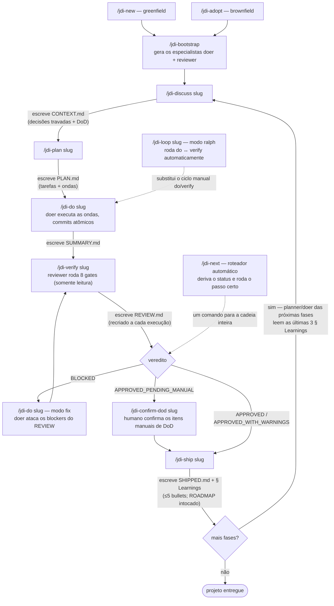
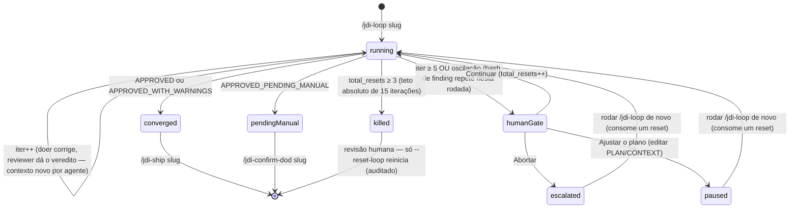
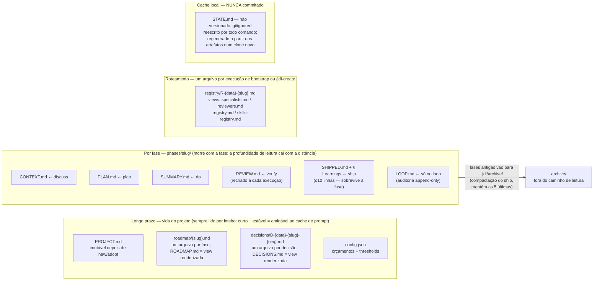
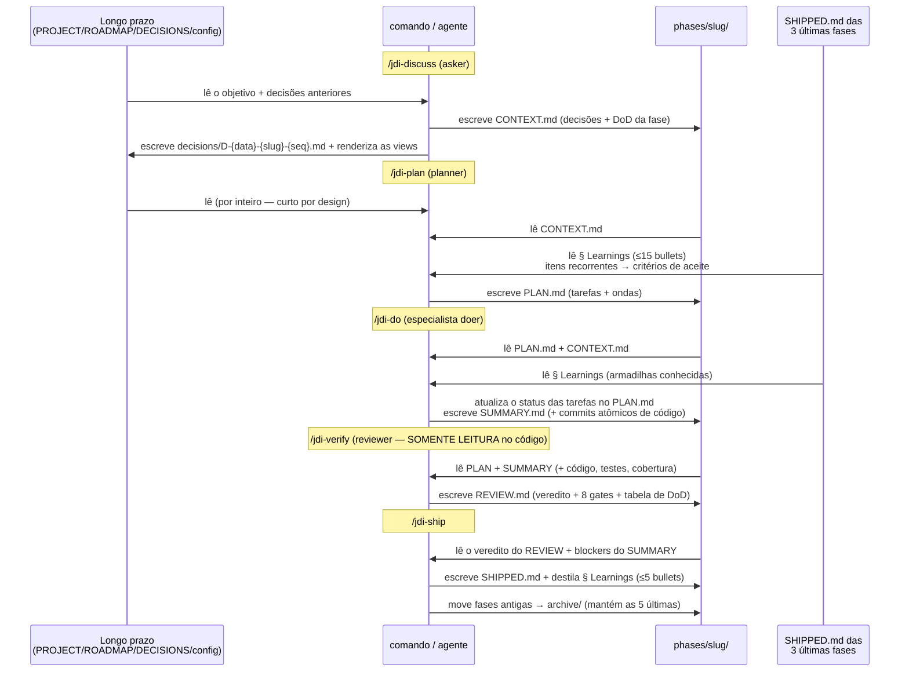

# JDI — Just Do It

🌐 [English](README.md) | **Português (BR)**

> 🇧🇷 Tradução para português (pt-BR) do README original em inglês.
> Nomes de comandos, flags, arquivos, agentes, skills e valores literais (`APPROVED`, `BLOCKED`, etc.) foram mantidos no original de propósito — mudá-los quebraria o uso.

```
     ██╗██████╗ ██╗
     ██║██╔══██╗██║
     ██║██║  ██║██║
██   ██║██║  ██║██║
╚█████╔╝██████╔╝██║
 ╚════╝ ╚═════╝ ╚═╝

◄══════════════════════════════════════════════|=|◉|=|/////|==
◄══════════════════════════════════════════════|=|◉|=|/////|==
◄══════════════════════════════════════════════|=|◉|=|/////|==

Corte o caos. Entregue o trabalho. [Just do it]
```

Toolkit de workflow enxuto para desenvolvedores (solo ou em time) + assistente de IA. Loop adaptativo, commits atômicos, estado em arquivos, contexto novo a cada agente, paralelismo por ondas, zero conflito de merge no estado compartilhado. Especialistas por projeto que já conhecem a sua stack.

## Por quê

Workflows de IA "completos" (33+ agentes, 60+ comandos, 100+ subworkflows) queimam tokens e cerimônia. O JDI entrega o que importa e corta o resto:

- **7 agentes core** + **2 por projeto** (doer + reviewer, gerados pelo `/jdi-bootstrap`)
- **17 comandos** — `/jdi-issue` (intake autônomo de cards) + `/jdi-next` (roteador automático) + loop principal de 7 passos + confirmação de DoD + entrada brownfield + modo ralph + status (+ métricas com `--stats`) + 2 de mutação de roadmap + migração + meta
- **Estado em arquivos** em `.jdi/` (Markdown + frontmatter, sem banco de dados) — livre de conflitos de merge para times por construção
- **Multi-runtime:** Claude Code, GitHub Copilot, Google Antigravity, OpenCode, JetBrains Junie
- **Zero dependência de runtime** — apenas a stdlib do Node
- **Brownfield suportado** — adota projetos existentes, não só greenfield
- **Multi-stack** — N pares de especialistas com roteamento por file-glob (ex.: backend C# + frontend React)
- **MCP opcional** — instalação one-shot do Playwright MCP em Claude/OpenCode/Copilot/Antigravity (Junie: configuração de MCP manual)

## Quando NÃO usar o JDI

Escopo honesto. O JDI compensa quando o projeto vive o suficiente para a estrutura render juros — fases, decisões travadas, aprendizados, um reviewer que bloqueia. Ele NÃO compensa para:

- **Protótipos descartáveis / scripts de fim de semana** — a cerimônia (discutir → planejar → fazer → verificar → entregar) custa mais que o erro que ela previne. Converse direto com o seu agente; ali a ferramenta honesta é essa.
- **Exploração pura** — quando você ainda não sabe o que está construindo, especificações e DoD são chute. Explore primeiro e rode `/jdi-adopt` depois, se aquilo sobreviver.
- **Correções de um arquivo em repositórios que não são seus** — um PR de passagem não precisa de roadmap.

Regra de bolso: **custo de um erro × quanto tempo o código vai viver**. Baixo nos dois → pule o JDI. Alto em qualquer um → os gates se pagam.

## Início rápido — `npx` em 30 segundos

```bash
cd /caminho/para/seu/projeto
npx jdi-cli@latest install opencode
```

Pronto. Troque `opencode` por `claude`, `copilot`, `antigravity` ou `all`, conforme o runtime que você usa.

> Não deu `cd` antes? O `npx` roda no diretório atual. Confirme sempre com `pwd` (Linux/Mac) ou `Get-Location` (Windows).

### Pré-requisitos

- **Node.js 18+** (para o `npx`)
- **git**
- Ao menos um runtime: Claude Code, GitHub Copilot, Antigravity ou OpenCode

## O fluxo

Todo comando de fase aceita ou um **slug** (`auth-flow`, canônico) ou uma **posição** inteira (`2`, ordem de exibição). Slugs são estáveis entre merges de branch; posições não são. Fases novas usam slug-como-ID por padrão; projetos legados no formato `NN-slug` continuam funcionando até você optar pelo `/jdi-migrate-phases`.

**Não quer memorizar a sequência?** Rode `/jdi-next` repetidamente — ele deduz em que ponto a fase está a partir dos artefatos e executa o próximo passo correto (incluindo o fix-após-BLOCKED e o roteamento para confirmação de DoD). Um comando só para lembrar; os de baixo continuam disponíveis para controle fino.

Cada comando escreve UM artefato na pasta da fase — o artefato É o gate para o comando seguinte, e o status da fase é derivado de quais artefatos existem (nada nunca é armazenado como "status"):



A qualquer momento: `/jdi-next` (roteia automaticamente para o próximo passo), `/jdi-status` (snapshot somente leitura; `--stats` adiciona métricas de resultado), `/jdi-add-phase` / `/jdi-remove-phase` (mutação de roadmap, seguro em time).

**Intake totalmente autônomo:** `/jdi-issue <url-do-github | id-do-tracker | texto do card>` — do card ao PR sem humano na corrente. O rigor compensa o humano ausente: crítico de DoD forçado, warnings ganham uma rodada de correção, fusíveis rígidos de iteração, critérios que só um humano avalia entram no corpo do PR como "Deferred to PR review"; loops mortos (killed) nunca entregam, e o JDI nunca faz merge do PR. Dispare isso a partir de CI/webhooks para trabalho proativo — o runtime é o executor, o JDI segue sem daemon.

### Greenfield (projeto novo)

```bash
/jdi-next                                  # <- ou rode cada passo você mesmo:

/jdi-new "<descrição curta>" [--auto]      # <- pesquisa + PROJECT.md + ROADMAP.md (--auto: zero perguntas, o researcher decide e registra a justificativa)
/jdi-bootstrap                             # <- doer + reviewer por projeto
/jdi-discuss <slug|posição>                # <- captura as decisões travadas (CONTEXT.md)
/jdi-plan    <slug|posição>                # <- decompõe em tarefas + ondas (PLAN.md)
/jdi-do      <slug|posição>                # <- executa via especialista doer (SUMMARY.md)
/jdi-verify  <slug|posição>                # <- gates via reviewer (REVIEW.md, recriado a cada execução)
/jdi-confirm-dod <slug|posição>            # <- só se o veredito for APPROVED_PENDING_MANUAL (itens manuais de DoD)
/jdi-ship    <slug|posição> [--pr]         # <- escreve o marcador SHIPPED.md (+ abre PR via gh com --pr)

# Mutação de roadmap (rode a qualquer momento, seguro com múltiplos devs)
/jdi-add-phase "<nome>" [--slug s] [--before <slug>|--after <slug>]
/jdi-remove-phase <slug|posição> [--force]

# Migração v0/v1 → v2 (uma única vez, não destrutiva)
/jdi-migrate-phases [--dry-run]            # <- estampa schema_version: 2 no STATE.md

# Continuidade / onde eu parei?
/jdi-status [--stats]                      # <- snapshot compacto: fase + última ação + próximo passo
```

### Brownfield (projeto existente)

```bash
/jdi-adopt                                 # <- escaneia o repo, infere stack/code-design, confirma com o usuário
/jdi-bootstrap                             # <- doer + reviewer (ciente da adoção: cobertura só em arquivos novos)
/jdi-discuss <slug|posição>                # <- ... daqui pra frente, igual ao greenfield
/jdi-plan    <slug|posição>
/jdi-do      <slug|posição>
/jdi-verify  <slug|posição>
/jdi-ship    <slug|posição>
```

O `/jdi-adopt` detecta manifestos (`package.json`, `pyproject.toml`, `go.mod`, `Cargo.toml`, `*.csproj`, `pom.xml`), infere o layout (DDD / Vertical Slice / Clean / Hexagonal / The Method / legado-misto), lê o `README.md` em busca de uma pista da visão, captura os ativos existentes e SEMPRE confirma o code-design com você antes de travar (D-1). Registra o hash do commit de fronteira em D-2, para que o reviewer exija cobertura apenas nos arquivos criados DEPOIS da adoção.

### Modo ralph (auto-iteração)

Em vez de rodar `/jdi-do` e depois `/jdi-verify` na mão, use:

```bash
/jdi-loop <slug|posição>
```

Roda `/jdi-do` ↔ `/jdi-verify` num loop limitado (padrão: 5 iterações por rodada, máximo de 3 resets = 15 iterações no total absoluto). Sai quando o veredito é `APPROVED` ou `APPROVED_WITH_WARNINGS`; um veredito `APPROVED_PENDING_MANUAL` encerra de forma limpa, roteando para `/jdi-confirm-dod` (o loop não pode confirmar itens manuais de DoD). A detecção de oscilação (comparação de hash dos findings ao longo da rodada atual) mata loops sem saída cedo. Retomar um loop `escalated`/`paused` consome um reset; um loop `killed` é final, a menos que você passe `--reset-loop` (com confirmação e auditoria).

Cada iteração acrescenta uma linha em `phases/<slug>/LOOP.md` (trilha de auditoria append-only); o frontmatter acompanha `iter`, `total_resets` e `status`:



## Modelo de estado — `.jdi/`

```
seu-projeto/
├── .jdi/                          # arquivos de estado (gerados pelos comandos do JDI)
│   ├── PROJECT.md                 # visão, stack, code-design, § Definition of Done (TRAVADO depois de /jdi-new ou /jdi-adopt)
│   ├── config.json                # orçamento de tokens/contexto, thresholds, compactação, modo de orquestração
│   ├── VERSION                    # versão do JDI instalada
│   ├── roadmap/                   # FONTE DE VERDADE (layout v3): um arquivo por fase — _header.md + {slug}.md (ordem: frontmatter)
│   ├── decisions/                 # FONTE DE VERDADE: um arquivo por decisão — D-{data}-{slug}-{seq}.md (nome do arquivo = ID) + LEGACY.md
│   ├── todos/                     # FONTE DE VERDADE: um arquivo por lote de todos — {data}-{slug}.md + LEGACY.md
│   ├── registry/                  # FONTE DE VERDADE: um arquivo por execução de bootstrap ou /jdi-create — R-{data}-{slug}.md + LEGACY*.md
│   ├── ROADMAP.md                 # VIEW RENDERIZADA de roadmap/ (não versionada; formato legado — SEM status, SEM ponteiro de fase atual)
│   ├── DECISIONS.md               # VIEW RENDERIZADA de decisions/ (não versionada)
│   ├── todos.md                   # VIEW RENDERIZADA de todos/ (não versionada)
│   ├── specialists.md             # VIEW RENDERIZADA de registry/ (não versionada) — além de reviewers.md, registry.md, skills-registry.md
│   ├── STATE.md                   # cache CONSULTIVO do próximo passo — não versionado/gitignored; regenerado a partir dos artefatos quando ausente
│   ├── agents/                    # especialistas por projeto
│   │   ├── jdi-doer-{slug}.md
│   │   └── jdi-reviewer-{slug}.md
│   ├── phases/
│   │   ├── <slug>/                # layout v2 (padrão para projetos novos)
│   │   │   ├── CONTEXT.md         # de /jdi-discuss
│   │   │   ├── PLAN.md            # de /jdi-plan
│   │   │   ├── SUMMARY.md         # de /jdi-do
│   │   │   ├── REVIEW.md          # de /jdi-verify (veredito + checklist de DoD; recriado a cada execução)
│   │   │   ├── SHIPPED.md         # de /jdi-ship (marcador de conclusão — é isso que torna uma fase "done")
│   │   │   └── LOOP.md            # só se o /jdi-loop rodou (estado do ralph)
│   │   └── NN-<slug>/             # layout legado v1 — NUNCA renomeado (preserva o histórico do git)
│   ├── archive/                   # fases antigas movidas pela compactação do ship (padrão: manter as 5 últimas ativas)
│   └── cache/                     # gitignored — artefatos do gate 7 (screenshots, findings em JSON)
├── .claude/                       # (se runtime=claude)
│   ├── agents/jdi-*.md
│   ├── commands/jdi-*.md
│   └── settings.example.json
├── .githooks/                     # só se instalado com --githooks (opt-in, scripts no-op)
├── .gitattributes                 # apenas normalização de EOL — o v3 não precisa de merge driver (ver "Uso em time")
├── CLAUDE.md                      # instruções do runtime
└── {seu código}
```

Para outros runtimes, troque `.claude/` por `.github/`, `.agents/` (Antigravity 2.0) ou `.opencode/`. Veja [PORTABILITY.md](https://github.com/Douglasproglima/jdi-cli/blob/main/PORTABILITY.md).

### Camadas de memória — quem escreve o quê, e por quanto tempo

O `.jdi/` é memória em camadas. Cada camada tem um tempo de vida diferente e um único escritor — é isso que a torna segura para merge e barata de ler:



**Escada de profundidade de leitura (economia de tokens):** fase atual = corpo inteiro · fase anterior = só frontmatter + veredito · 2 ou mais atrás = nunca lida (apenas `ls`/`head`) · exceção: a `§ Learnings` dos 3 últimos SHIPPED.md (≤10 linhas cada). Os arquivos de longo prazo são sempre lidos por inteiro — são curtos por design e estáveis, então caem no cache de prompt.

### Quando a memória é escrita e lida (uma fase, ponta a ponta)

Setas cheias = escritas. Todo comando também reescreve o cache local `STATE.md` (não mostrado — não versionado, apenas consultivo):



O ciclo: o que uma fase APRENDE (warnings, blockers, waivers) sobrevive como no máximo 5 bullets destilados que o planner e o doer das PRÓXIMAS fases consomem — ~300 tokens em vez de arrastar arquivos REVIEW inteiros adiante. Schema completo: [MEMORY.md](https://github.com/Douglasproglima/jdi-cli/blob/main/MEMORY.md).

### Invariantes

- O `PROJECT.md` é **imutável** depois do `/jdi-new` ou do `/jdi-adopt`
- **Decisões são arquivos de escrita única.** Decisões travadas nunca são revertidas — e o reviewer verifica isso: o Gate 6 BLOQUEIA um diff que contradiga uma decisão travada. O layout v3 guarda um arquivo por decisão (`decisions/D-YYYY-MM-DD-slug-seq.md`, nome do arquivo = ID, livre de colisão entre branches; as decisões de origem mantêm `D-1` code design / `D-2` fronteira de adoção); a view `DECISIONS.md` é regenerada, nunca editada. Projetos legados continuam acrescentando ao `DECISIONS.md` até migrarem
- **O registry é de arquivos de escrita única** — um `registry/R-{data}-{slug}.md` por execução de bootstrap ou `/jdi-create`; o `registry.md` e as tabelas de roteamento são views renderizadas
- **O status da fase é derivado dos artefatos, nunca armazenado**: `SHIPPED.md` → done, `REVIEW.md` → verified, `SUMMARY.md` → executed, `PLAN.md` → planned, `CONTEXT.md` → discussed, nada → pending. O ROADMAP.md não carrega status por fase nem ponteiro de fase atual; o STATE.md é apenas uma dica consultiva
- **Slugs de fase nunca mudam.** Pastas `NN-slug/` existentes nunca são renomeadas na migração. Posições numéricas (`### Phase 3`) são só para exibição e podem ser renumeradas ao inserir/remover
- Todo comando é **idempotente** — reexecutar pergunta antes de sobrescrever
- O reviewer é **somente leitura por design** (sem Write/Edit). O doer é o único escritor

## Gates entre comandos

| De | Para | Gate |
| --- | --- | --- |
| `/jdi-bootstrap` | `/jdi-discuss` | os especialistas doer + reviewer existem em `.jdi/agents/` (obrigatório) |
| `/jdi-discuss` | `/jdi-plan` | o `CONTEXT.md` existe (com `## Definition of Done`) |
| `/jdi-plan` | `/jdi-do` | PLAN válido (toda tarefa tem `files_modified`, `acceptance`, `dependencies`, `test`, `specialist`) |
| `/jdi-do` | `/jdi-verify` | o `SUMMARY.md` existe |
| `/jdi-verify` | `/jdi-confirm-dod` | veredito == `APPROVED_PENDING_MANUAL` (itens manuais de DoD pendentes) |
| `/jdi-verify` | `/jdi-ship` | veredito ∉ {`BLOCKED`, `APPROVED_PENDING_MANUAL`} + zero linhas `MANUAL_REQUIRED` restantes no checklist de DoD + `SHIPPED.md` ausente |

## Uso em time

O `.jdi/` é commitado no git — ele É o estado compartilhado. O que isso entrega para um time:

- **Um bootstrap serve o time inteiro.** Os especialistas gerados em `.jdi/agents/` são compartilhados pelo repositório; um colega que clona o projeto recebe o doer + reviewer de graça.
- **Slugs são a identidade estável das fases entre branches.** Posições renumeram; slugs nunca. Todos os artefatos, escopos de commit e IDs de decisão se ancoram no slug.
- **ROADMAP sem status = zero conflito de merge no ship.** O `/jdi-ship` escreve `phases/<slug>/SHIPPED.md` em vez de editar o ROADMAP.md — dois desenvolvedores entregando fases diferentes em branches diferentes tocam arquivos disjuntos.
- **O status é derivado, nunca armazenado.** Qualquer clone responde "onde está a fase X?" apenas pelos artefatos: `SHIPPED.md` → done, `REVIEW.md` → verified, `SUMMARY.md` → executed, `PLAN.md` → planned, `CONTEXT.md` → discussed, nada → pending.
- **O STATE.md é cache local, nunca versionado (0.3.0+).** Todo comando o reescreve, então commitá-lo garantia conflito em todo merge — agora ele vive no `.gitignore` e os comandos o regeneram a partir dos artefatos num clone novo. Projetos existentes: `git rm --cached .jdi/STATE.md && echo '.jdi/STATE.md' >> .gitignore`.
- **Streams com múltiplos escritores usam um-arquivo-por-entrada (layout v3, 0.13.0+).** Decisões, todos, entradas de roadmap e linhas do registry vivem cada uma em seu próprio arquivo — dois branches escrevem dois arquivos diferentes, e arquivos diferentes nunca conflitam. Veja a próxima seção para entender por que `merge=union` NÃO foi suficiente.
- **Os IDs do DECISIONS v2 são livres de colisão — e são o nome do arquivo.** `D-{YYYY-MM-DD}-{slug}-{seq}` — dois devs travando decisões em fases diferentes no mesmo dia nunca colidem. As entradas do registry seguem o mesmo esquema: `R-{YYYY-MM-DD}-{slug}`.
- **Aprendizados viajam entre fases.** O `/jdi-ship` destila os warnings/blockers da revisão em no máximo 5 bullets no `SHIPPED.md § Learnings`; o planner e o doer das fases seguintes leem os 3 últimos e transformam itens recorrentes em critérios de aceite — falhas recorrentes param de recorrer.
- **Recomendado: uma fase por branch/dev.** Os arquivos de cada fase vivem na própria pasta `phases/<slug>/`, então dar merge no `.jdi/` é trivial — os arquivos por fase são disjuntos por construção. Colisões de mesmo slug aparecem como conflito explícito do git, não como sobrescrita silenciosa.
- **Recomendado: coloque o seu `test_command` no CI.** Os gates do JDI são executados por agentes; um job de CI rodando o comando de teste do PROJECT.md (+ cobertura) é a rede de segurança determinística que nenhum agente consegue pular.

### Livre de conflitos por construção — layout v3 (0.13.0+)

**O incidente que forçou isso:** um PR real de dois branches conflitou em `.jdi/DECISIONS.md`, `.jdi/ROADMAP.md` e `.jdi/todos.md` mesmo com todos os arquivos marcados com `merge=union`. Causa raiz, reproduzida e confirmada: **o GitHub (e o GitLab, e o Azure DevOps) fazem merges de PR no lado do servidor que IGNORAM os merge drivers do `.gitattributes`.** O `merge=union` só protegia execuções de `git merge` na sua própria máquina — nunca a página do PR, que é justamente onde os times realmente fazem merge. (O Kubernetes removeu o union do repositório deles exatamente por esse motivo — [kubernetes/kubernetes#70576](https://github.com/kubernetes/kubernetes/pull/70576).)

Então o v3 deixa de depender de merge drivers por completo. A regra é estrutural: **um arquivo = um escritor**.

| Stream | Fonte de verdade (versionada) | View (não versionada, renderizada) |
| --- | --- | --- |
| Roadmap | `.jdi/roadmap/{slug}.md` (frontmatter `order:`, inserções fracionárias) | `.jdi/ROADMAP.md` |
| Decisões | `.jdi/decisions/D-{data}-{slug}-{seq}.md` (nome do arquivo = ID) | `.jdi/DECISIONS.md` |
| Todos | `.jdi/todos/{data}-{slug}.md` | `.jdi/todos.md` |
| Bootstrap / `/jdi-create` | `.jdi/registry/R-{data}-{slug}.md` (seções delimitadas) | `registry.md`, `specialists.md`, `reviewers.md`, `skills-registry.md` |

Dois devs adicionando fases, travando decisões ou dando bootstrap em stacks em branches paralelos criam **arquivos diferentes** — não há nada para conflitar, em nenhuma plataforma, com zero configuração de git. As views são regeneradas por `npx -y jdi-cli render` (determinístico byte a byte; os renderizadores `.sh` e `.ps1` produzem saída idêntica); todo comando as atualiza na entrada, então agentes e greps continuam lendo os mesmos caminhos de antes. Dois `add-phase` concorrentes escolhendo o mesmo `order` dão merge sem problema e aparecem como um aviso de ordem duplicada com desempate estável — um warning, não um conflito. Conflitos deliberados continuam visíveis: edições em PROJECT.md/config.json e um remove-phase disputando com o trabalho de outra pessoa (modify/delete) são sinais que você quer ver.

**Migrando um projeto existente (correção retroativa):**

```bash
npx -y jdi-cli migrate-layout --dry-run   # mostra o plano, não escreve nada
npx -y jdi-cli migrate-layout             # divide + congela + renderiza (staged, não commitado)
git commit -m "chore(jdi): migrate .jdi/ to conflict-free layout (v3)"
```

- Idempotente — reexecutar num projeto já em v3 apenas atualiza as views.
- Não destrutivo — o ROADMAP.md é dividido em `roadmap/` (headers/footers preservados); DECISIONS.md/todos.md e as tabelas do registry são congelados como arquivos `LEGACY*` via `git mv`, então o histórico do git e toda referência `D-N` continuam válidos. As views concatenam LEGACY + entradas novas — quem lê vê um arquivo contínuo, exatamente como antes.
- Branches criados **antes** da migração ainda editam os caminhos versionados antigos e batem em UM conflito visível de delete/modify no merge — faça rebase deles (ou reexecute o passo JDI correspondente) depois que a migração cair no branch default.
- Fiscalização: o hook de pre-commit e o workflow de CI `jdi-artifacts-gate` reprovam qualquer commit/PR que versione uma view ou edite um arquivo LEGACY, imprimindo a correção por entrada; o `npx -y jdi-cli doctor` alerta enquanto o projeto ainda estiver no layout legado.

### Concorrência entre múltiplos desenvolvedores (schema v2)

Vários desenvolvedores podem rodar o JDI em paralelo no mesmo projeto, desde que o projeto esteja no **schema v2**.

**O problema do v1 (IDs numéricos):**

- O identificador da fase era a posição no ROADMAP (`current_phase: 5`).
- Dois devs em branches paralelos pegam `total_phases + 1` → ambos criam `.jdi/phases/06-foo/` e `.jdi/phases/06-bar/` → colisão silenciosa no merge.
- Os IDs de decisão `D-X` e as entradas de registry `R-X` tinham a mesma corrida.

**Como o v2 resolve:**

- O identificador da fase é um **slug** (`auth-flow`, `payments`). Validado na criação: formato (`[a-z][a-z0-9-]{2,39}`, sem `--`, sem `-` no final), lista de palavras reservadas (12 palavras: `current`, `all`, `none`, `archive`, `removed`, `history`, `latest`, `pending`, `ready`, `done`, `blocked`, `partial`), unicidade contra as pastas E o ROADMAP.
- O layout de pastas passa a ser `.jdi/phases/<slug>/` (sem prefixo `NN-`). Dois devs escolhendo slugs diferentes produzem pastas disjuntas — o git dá merge limpo. Dois devs escolhendo o **mesmo** slug provocam um conflito explícito do git, não uma sobrescrita silenciosa.
- O cabeçalho `### Phase N:` é só exibição — pode ser renumerado quando fases são inseridas/removidas, sem afetar as referências por slug.
- Os IDs do `DECISIONS.md` tornam-se determinísticos: `D-{YYYY-MM-DD}-{phase_slug}-{seq}` (livres de colisão entre branches).
- Os escopos de commit usam slugs: `chore(payments): ...` em vez de `chore(NN-payments): ...`.

**Workflow recomendado com múltiplos desenvolvedores:**

```bash
git pull
/jdi-add-phase "<nome>" --slug <slug-único>   # o validador recusa duplicatas localmente
git push                                      # se o remoto avançou, faça pull/rebase primeiro; colisão de slug (raro) é um sinal real
```

**Migração a partir do v1 (projetos existentes com IDs numéricos):**

```bash
/jdi-migrate-phases --dry-run   # mostra a auditoria + o plano, não escreve nada
/jdi-migrate-phases             # confirma e estampa schema_version: 2 (+ current_phase_slug) no STATE.md
```

- Idempotente: reexecutar num projeto v2 não faz nada.
- **Não destrutivo:** pastas `NN-slug/` existentes NUNCA são renomeadas (as referências do histórico do git seguem válidas). Fases novas usam pastas só com slug.
- A auditoria de pré-voo checa a paridade pasta/ROADMAP, slugs canônicos duplicados e o formato do slug — aborta com erro nomeado antes de escrever qualquer coisa.
- Recusa quando a working tree do `.jdi/` está suja (a menos que use `--force`), para que o commit da migração fique auditável.

Os dois schemas coexistem depois da migração — as pastas antigas continuam funcionando, as novas usam o layout novo. Todo comando aceita as duas formas de ID (`/jdi-do 2` e `/jdi-do auth-flow` resolvem para a mesma fase).

A detecção de schema é automática pelo campo `schema_version` do `STATE.md` (`1` ou ausente = v1; `2` = v2; a ausência do STATE.md implica v2 — ele é um cache não versionado). O resolver e o validador vêm no pacote npm e são expostos como subcomandos de CLI — os comandos chamam `npx -y jdi-cli resolve-phase` / `validate-slug`, então nenhum código auxiliar é copiado para o seu repositório.

## Issues delegadas — Linear/GitHub → agente de código do Copilot (`jdi-solo`)

Delegue um card ao agente de código do GitHub Copilot (do Linear, do GitHub Issues ou do painel Agents) e receba de volta um PR que seguiu o protocolo JDI COMPLETO — artefatos, loop, gates — sem humano na sessão.

Uma sessão delegada não tem nada a ver com o chat do VS Code: uma única persona autoselecionada de `.github/agents/`, sem sub-agentes, sem humano, um harness que commita automaticamente e um CI silencioso até ser aprovado. O JDI entrega três camadas para isso:

| Camada | Peça | O que ela garante |
| --- | --- | --- |
| Persona | agente `jdi-solo` (7º agente core) | Executa o `/jdi-issue` ponta a ponta inline: artefatos ANTES do código, gates executados (nunca narrados), `git add` explícito por artefato, tetos do loop intactos, nunca faz merge |
| Gate na sessão | `.githooks/pre-commit` (ativado pelo `copilot-setup-steps.yml`) | Um commit que toca código sem `CONTEXT.md`+`PLAN.md` de uma fase ativa em stage fica VERMELHO dentro da própria sessão do agente, com a correção impressa |
| Gate no merge | `.github/workflows/jdi-artifacts-gate.yml` | Um PR `copilot/*` que toca código sem os 5 artefatos + um veredito entregável (`validate-phase --for-pr`) não consegue ficar verde |

### Setup (uma vez por repositório)

```bash
# 1. Instale o runtime do copilot COM os hooks (o gate de sessão)
npx -y jdi-cli install copilot --scope project --githooks

# 2. Commite e dê merge no branch DEFAULT (os setup-steps só disparam a partir dele)
git add .github/ .githooks/ && git commit -m "ci: JDI coding-agent enforcement" && git push
```

Requisitos já resolvidos para você: o workflow de setup pré-instala o Node 20 e ativa o `core.hooksPath`; a allowlist padrão do firewall do Copilot inclui o registry do npm, então o `npx -y jdi-cli` funciona dentro da sessão.

Opcional — repositórios cujo código não vive em `src/`:

```jsonc
// .jdi/config.json
{ "gate": { "code_globs": ["src/**", "app/**", "lib/**"] } }
```

### Delegando

- **Do Linear**: conecte a [integração do GitHub Copilot](https://linear.app/integrations/github-copilot) e delegue a issue. O Linear não expõe um seletor de agente — o motor autosseleciona a persona, e é exatamente por isso que a descrição do `jdi-solo` é o atrator e todo outro agente `jdi-*` carrega um aviso de anti-seleção.
- **Do GitHub**: atribua a issue ao Copilot (ou use o painel Agents) e escolha **`jdi-solo`** no dropdown de agente customizado quando ele aparecer.
- **Do Copilot CLI**: `/delegate` depois de selecionar o agente.

Escreva os cards do jeito que o `/jdi-issue` os consome: título claro, contexto no corpo e critérios de aceite como checklists `- [ ]` (eles se tornam a Definition of Done da fase — `dod=auto_only`, então os critérios devem ser mecanicamente verificáveis).

### O que volta

Um branch `copilot/...` cujo PR contém a sua mudança de código **mais** `.jdi/phases/<slug>/` com `CONTEXT.md`, `PLAN.md`, `SUMMARY.md`, `REVIEW.md` (veredito ≠ BLOCKED), `SHIPPED.md`, `LOOP.md` — a prova de que o protocolo rodou. Clique em **"Approve and run workflows"** no PR (o GitHub exige isso para PRs de agente) para que o `jdi-artifacts-gate` possa falar; revise; faça o merge você mesmo. O JDI nunca faz merge.

Se o agente cortou caminho de todo jeito, o gate falha com uma lista de pendências por artefato — comente `@copilot` citando essa lista e o agente corrige o próprio PR.

### Verificar / resolver problemas

```bash
npx -y jdi-cli validate-phase <slug> --for-pr   # a mesma checagem que o CI roda, executável em qualquer lugar
npx -y jdi-cli doctor                            # a seção 13 cobre a prontidão para o agente de código
```

- **Persona errada escolhida** (o log da sessão mostra `Selecting custom agent "jdi-asker"`, etc.): os avisos de anti-seleção tornam isso raro, mas os gates ainda pegam o resultado — o PR não pode ficar verde sem artefatos. Delegue de novo mencionando "use the jdi-solo agent".
- **Os artefatos existiam na sessão, mas não no PR**: o harness só commita automaticamente arquivos rastreados — é por isso que o `jdi-solo` dá stage explícito em todo artefato e o hook valida o ÍNDICE, não a worktree.
- **`npx` bloqueado**: sua organização customizou a allowlist do firewall — readicione `registry.npmjs.org` (Settings → Coding agent).

Alternativa de fidelidade máxima (sub-agentes reais + crítico forçado): rode `/jdi-issue <url-do-card>` em modo headless no seu próprio runner (Claude Code CLI ou Copilot CLI disparado por um webhook de label) em vez de delegar ao agente de código hospedado.

## Multi-stack — N pares de especialistas

Por padrão, o JDI cria **1 doer + 1 reviewer por projeto**. Para fullstack (backend + frontend), mobile (iOS + Android) ou projetos poliglotas, opte pelo multi-stack no `/jdi-bootstrap`:

```
O bootstrap pergunta: "Project stack count?"
  - Single (1 par de especialistas)
  - Multi (2 pares — ex.: backend + frontend)
  - Multi (3 pares — ex.: backend + frontend + infra)
  - Multi (quantidade customizada)
```

Para cada especialista, você fornece um `stack_label` + um `file_glob`:

| Especialista | Stack label | File glob |
| --- | --- | --- |
| 1 | Backend C# | `**/*.{cs,csproj,sln}` |
| 2 | Frontend React | `**/*.{ts,tsx,jsx,css,scss}` |
| 3 | Infra Terraform | `**/*.{tf,tfvars}` |

### Como o roteamento funciona

- `.jdi/specialists.md` + `.jdi/reviewers.md` recebem uma linha por par (o schema v2 adiciona a coluna `File glob`)
- O `/jdi-plan` casa o `files_modified` de cada tarefa contra os globs e atribui automaticamente um especialista por tarefa. Tarefas que atravessam 2 ou mais globs são divididas automaticamente em subtarefas
- O `/jdi-do` lê `task.specialist` do PLAN.md e sobe o doer correto por tarefa. Dentro de uma onda, tarefas diferentes podem subir especialistas diferentes em paralelo (escopos disjuntos)
- O `/jdi-verify` encadeia os reviewers sequencialmente (portas de build/test + locks colidiriam em paralelo). Cada reviewer limita os gates ao seu glob. Veredito final = pior caso (1 BLOCK = BLOCK geral)

Projetos single-stack (1 linha) seguem inalterados — retrocompatível.

## Suporte a frontend — autodetecção + gates de UI/UX

Se o seu projeto tem interface web, o JDI ativa um conjunto extra de gates focados em UI/UX. A detecção roda contra:

- `package.json` procurando React, Vue, Svelte, Solid, Angular, Astro, Next, Nuxt, Remix, SvelteKit, Qwik, Preact
- Razor/Blazor (`*.razor`, `*.cshtml`)
- Templates Django/Flask (`templates/*.html`)
- Rails (`app/views/*.erb`)
- Laravel (`resources/views/*.blade.php`)
- `index.html` puro

### O que é carregado automaticamente

**Skill `frontend-rules`** — checklist universal de UI/UX (**WCAG 2.2 AA + Nielsen + Material/Apple HIG**). Agnóstica de framework. Cobre:

- Acessibilidade (contraste 4.5:1, foco visível, navegação por teclado, ARIA, HTML semântico, alvos de toque, labels)
- Estados obrigatórios (loading / vazio / erro / sucesso / desabilitado)
- Formulários (validação, autocomplete, inputmode, toggle de senha, confirmações destrutivas)
- UX de performance (CLS < 0,1, LCP < 2,5s, INP < 200ms, UI otimista)
- Responsivo mobile-first
- i18n + l10n + RTL
- Segurança de UI (token nunca no localStorage, CSP, CSRF, `target=_blank` com noopener)
- Tabela de antipadrões em nível BLOCK com citação das regras WCAG

O doer aplica antes de escrever código. O reviewer usa como checklist do gate 5.

**Skill `frontend-validator`** — gate 7 do reviewer. Roda Playwright + axe-core num navegador real:

1. Detecta o Playwright. Se ausente, **pergunta antes de instalar** (4 opções: Chromium / todos os navegadores / pular o gate 7 / cancelar a revisão)
2. Detecta o gerenciador de pacotes pelo lockfile
3. Sobe o seu dev server e espera ficar pronto (timeout de polling de 60s)
4. Por rota crítica × **mobile (375×667)** + **desktop (1280×720)**:
   - Captura erros de console
   - Captura falhas de rede (4xx, 5xx, requestfailed)
   - Roda o axe-core (WCAG 2.0/2.1/2.2 AA + best-practices)
   - Detecta scroll horizontal
   - Screenshot de página inteira
5. Mata o dev server (sempre, mesmo em caso de erro)
6. Saída JSON em `.jdi/cache/ui-findings.json`

### Severidade dos findings

| Finding | Severidade |
| --- | --- |
| Erro de console em qualquer rota | BLOCK |
| Erro de rede 5xx em rota crítica | BLOCK |
| Violação de a11y `critical` ou `serious` | BLOCK |
| Scroll horizontal no mobile | BLOCK |
| Violação de a11y `moderate`, rede 4xx | WARN |
| Violação de a11y `minor`, scroll no desktop | INFO |
| Timeout do dev server | INCONCLUSIVE (warn) |
| Usuário recusou a instalação do Playwright | SKIPPED (warn) |

Nunca dá BLOCK por falha técnica — só por findings reais. O `.jdi/cache/` entra no gitignore automaticamente.

### Como isso liga

Você não faz nada. Quando você roda `/jdi-bootstrap` num projeto com UI:

1. A autodetecção dispara
2. O bootstrap pergunta: "Detected React in `package.json`. Confirm frontend?"
3. Se sim, 3 perguntas extras: comando do dev server (padrão por framework), URL do frontend (padrão por framework), rotas críticas (padrão `/`)
4. Persiste a seção `frontend:` no `PROJECT.md`
5. Injeta `<skills_to_load>` no doer + reviewer

Daí em diante, o `/jdi-do` carrega o `frontend-rules` quando uma tarefa toca arquivos de UI; o `/jdi-verify` roda o gate 7 com Playwright.

### Como desligar

Edite o `PROJECT.md`:

```yaml
frontend:
  has_frontend: false
```

O gate 7 retorna `SKIPPED`. A skill não carrega.

## Add-ons opcionais

### Playwright MCP — navegador ao vivo para as 4 CLIs

O `npx jdi-cli install-playwright` faz três coisas:

1. Instala o `@playwright/test` como devDependency (detecta pnpm/yarn/bun/npm pelo lockfile)
2. Instala o navegador Chromium (`npx playwright install chromium`, ~170MB) — pode ser pulado com `--skip-browser`
3. Injeta a configuração do servidor MCP do Playwright em todos os runtimes detectados:

| CLI | Caminho da config de MCP |
| --- | --- |
| Claude Code | `.claude/settings.local.json` (`mcpServers.playwright`) |
| OpenCode | `.opencode/opencode.jsonc` (`mcp.playwright`) |
| GitHub Copilot (VS Code) | `.vscode/mcp.json` (`servers.playwright`) |
| Antigravity (Google) | 2.0: `~/.gemini/config/mcp_config.json` em escopo de usuário (autodetectado via `~/.gemini/config/` ou o binário `agy`; a 1.x cai para `~/.gemini/settings.json`) OU `.gemini/settings.json` em escopo de projeto (`mcpServers.playwright`) |

Idempotente: pula a dependência se já estiver no `package.json` e pula a entrada de MCP se já existir.

Reinicie o seu runtime para carregar o MCP depois da instalação.

Se `frontend.has_frontend: true` estiver definido no `PROJECT.md`, o `/jdi-bootstrap` oferece essa instalação interativamente (passo S9).

### Plugin Caveman — compressão de tokens

O `npx jdi-cli install-caveman` clona o plugin [Caveman](https://github.com/JuliusBrussee/caveman) em:

- **Escopo de usuário (padrão):** `~/.claude/plugins/caveman/`
- **Escopo de projeto:** `.claude/plugins/caveman/`

O Caveman é um plugin do Claude Code que comprime a saída do LLM em ~75% descartando artigos/enchimento/gentilezas, preservando a precisão técnica integral. Útil em sessões longas em que o orçamento de contexto importa.

Depois de instalar, reinicie o Claude Code. Alterne com `/caveman lite|full|ultra` ou desative com `stop caveman`.

O `/jdi-bootstrap` oferece essa instalação interativamente (passo S9.5, agnóstico de projeto).

## Doctor — 13 seções

```bash
npx jdi-cli doctor
npx jdi-cli doctor --verbose
```

1. Dependências (git, detecção de bash)
2. Runtimes instalados (claude, copilot, antigravity, opencode)
3. Ferramental opcional (ctx7, gh CLI)
4. Integridade do repositório JDI (`core/`)
5. Adaptadores construídos (`runtimes/`)
6. Projeto atual (arquivos do `.jdi/` + layout livre de conflito: no v3 checa se as views estão fora do versionamento e em sincronia via `render --check`; layout legado recebe um WARN com o comando de migração)
7. Runtime instalado no projeto
8. Git hooks configurados
9. Working tree limpa
10. Status do Playwright + MCP (todas as 4 CLIs)
11. Especialistas (single vs multi-stack, tamanho da cadeia de reviewers)
12. Status do plugin Caveman (escopo de usuário vs projeto)
13. Prontidão do agente de código (issues delegadas — Copilot: workflows, globs do gate, bit de execução do hook)

## Update

Detecta os runtimes instalados, sobrescreve os arquivos de runtime, preserva o estado e oferece regenerar os especialistas se os templates mudaram:

```bash
cd /caminho/para/seu/projeto
npx jdi-cli@latest update            # flags: --dry-run, --force-specialists, --skip-specialists
```

**O que o update toca:**

- Sobrescreve agentes, comandos e skills nos runtimes detectados
- Preserva `.jdi/PROJECT.md`, `DECISIONS.md`, `ROADMAP.md`, `STATE.md`, `phases/`, `registry.md`
- Preserva config customizada (`opencode.jsonc`, `settings.json`)
- Atualiza o `.jdi/VERSION`
- Detecta especialistas antigos (sem `<skills_to_load>`) e oferece a regeneração via `/jdi-bootstrap`

**O que o update NÃO toca:**

- `@playwright/test` (rode `jdi install-playwright` para atualizar)
- O navegador Chromium
- Configs de MCP em `.claude/settings.local.json` / `.opencode/opencode.jsonc` / `.vscode/mcp.json` / `~/.gemini/config/mcp_config.json` (2.0) / `~/.gemini/settings.json` (1.x)
- O plugin Caveman (rode `jdi install-caveman --force` para atualizar)

## Uninstall

```bash
npx jdi-cli@latest uninstall         # todos os runtimes detectados, preserva o .jdi/
                                     # flags: [runtime], --scope, --dry-run, --yes, --purge
```

O `--purge` apaga permanentemente as decisões travadas. Faça backup de `.jdi/DECISIONS.md` e `.jdi/ROADMAP.md` antes, se forem relevantes.

O uninstall também limpa arquivos órfãos de hook do update-notifier deixados por instalações ≤ 0.1.15 (recurso removido na 0.1.16 — apenas aqueles nomes de arquivo exatos, de propriedade do JDI, são tocados).

Fallback manual:

```bash
rm -rf .claude/ .github/ .agents/ .gemini/antigravity/ .opencode/ .githooks/ CLAUDE.md AGENTS.md
# .jdi/ é separado — destrutivo
rm -rf .jdi/
```

## Reset (limpeza total + reinício)

```bash
/jdi-new --reset "<nova descrição>"
```

Apaga o `.jdi/` após confirmação. Recria do zero. **CUIDADO** — você perde DECISIONS.md, ROADMAP.md, etc.

## Subcomandos da CLI

Referência rápida de cada flag por subcomando:

### `install <runtime>` — instala o JDI no projeto

| Flag | Valores | Padrão | Objetivo |
| --- | --- | --- | --- |
| `--scope` / `-s` | `user` \| `project` | `project` | `project` escreve `.claude/`/`.opencode/`/`.agents/` (Antigravity 2.0) no projeto; `user` escreve em `~/.claude/`, `~/.config/opencode/`, `~/.gemini/config/skills/` |
| `--githooks` | flag | false | **Opt-in:** copia git hooks no-op para `.githooks/`. Por padrão, NENHUM shell script é instalado no seu repositório (invariante de "nenhum código no repo do consumidor") |
| `--no-color` | flag | false | Desativa as cores ANSI |

```bash
npx jdi-cli@latest install claude
npx jdi-cli@latest install copilot
npx jdi-cli@latest install antigravity --scope user
npx jdi-cli@latest install opencode
npx jdi-cli@latest install all                       # todos os 5 runtimes de uma vez
```

### `install-playwright` — dev dep do Playwright + navegador chromium + config de MCP

| Flag | Valores | Padrão | Objetivo |
| --- | --- | --- | --- |
| `--skip-browser` | flag | false | Pula o `npx playwright install chromium` (~170MB) |
| `--skip-mcp` | flag | false | Instala apenas a dependência + navegador, sem injetar configs de MCP |
| `--runtime` | `claude` \| `opencode` \| `copilot` \| `antigravity` \| `all` | `all` | Limita a injeção de MCP a um runtime |
| `--antigravity-scope` | `user` \| `project` | `user` | user: `~/.gemini/config/mcp_config.json` na 2.0, senão `~/.gemini/settings.json` (1.x) · project: `.gemini/settings.json` |

```bash
npx jdi-cli@latest install-playwright
npx jdi-cli@latest install-playwright --skip-browser
npx jdi-cli@latest install-playwright --runtime claude
npx jdi-cli@latest install-playwright --skip-mcp                 # só dependência + navegador
npx jdi-cli@latest install-playwright --antigravity-scope project
```

### `install-caveman` — clona o plugin Caveman

| Flag | Valores | Padrão | Objetivo |
| --- | --- | --- | --- |
| `--repo` | URL git | `https://github.com/JuliusBrussee/caveman.git` | Sobrescreve o repositório de origem do caveman (suporte a fork) |
| `--scope` | `user` \| `project` | `user` | `~/.claude/plugins/caveman/` vs `.claude/plugins/caveman/` |
| `--force` | flag | false | Sobrescreve instalação existente sem perguntar |

```bash
npx jdi-cli@latest install-caveman                       # escopo de usuário, repo padrão
npx jdi-cli@latest install-caveman --scope project
npx jdi-cli@latest install-caveman --repo https://github.com/forked/caveman.git --force
```

### `update` — atualiza os arquivos de runtime, preserva o estado

| Flag | Valores | Padrão | Objetivo |
| --- | --- | --- | --- |
| `--dry-run` | flag | false | Mostra o que mudaria sem aplicar |
| `--force-specialists` | flag | false | Regenera os especialistas sem perguntar (assume Sim) |
| `--skip-specialists` | flag | false | Deixa os especialistas intactos mesmo se o template mudou |

O update NÃO atualiza a dependência do Playwright, as configs de MCP nem o plugin Caveman. Rode os subcomandos respectivos para atualizá-los.

### `uninstall [runtime]` — remove os arquivos do JDI

| Flag | Valores | Padrão | Objetivo |
| --- | --- | --- | --- |
| `--scope` | `user` \| `project` \| `both` | `both` | Limita o escopo da remoção |
| `--dry-run` | flag | false | Prévia sem aplicar |
| `--yes` | flag | false | Pula todos os prompts interativos |
| `--purge` | flag | false | **DESTRUTIVO:** também apaga o `.jdi/` (decisões travadas perdidas) |

### `doctor` — diagnóstico do ambiente

| Flag | Valores | Padrão | Objetivo |
| --- | --- | --- | --- |
| `--verbose` / `-v` | flag | false | Mostra linhas em nível de nota (debug) |

### `build` — regenera `runtimes/` a partir de `core/` (só para contribuidores)

Sem flags. Usado dentro do repositório fonte do JDI depois de editar `core/`.

### Subcomandos de plumbing (usados pelos slash commands)

Os helpers de fase vêm dentro do pacote npm e são expostos como subcomandos de CLI — os slash commands do JDI os chamam via `npx -y jdi-cli <helper>`, então **nenhum código do JDI é copiado para o seu repositório**:

| Subcomando | Objetivo |
| --- | --- |
| `resolve-phase <slug\|pos> [--json]` | Resolve um id de fase → `slug`, `dir`, `position`, `schema`, `folder_exists`. O `--json` emite JSON (amigável ao PowerShell) |
| `validate-slug <slug> [--check-unique]` | Valida o formato do slug + palavras reservadas (+ unicidade contra as pastas e o ROADMAP) |
| `validate-phase <slug\|pos> [--for-pr] [--quiet]` | Gate mecânico sobre a cadeia de artefatos da fase (status derivado, tornado executável). `--for-pr`: exige todos os 5 artefatos + veredito entregável — é a checagem que o `jdi-artifacts-gate.yml` roda, e a definição de "completo" para agentes delegados |
| `truncate <arquivo> <max_chars>` | Trunca um arquivo preservando frontmatter/cabeçalhos (orçamento de contexto) |
| `monitor <arquivo...>` | Estima o uso de orçamento de contexto dos arquivos indicados |
| `render [--check] [--quiet]` | Regenera as views não versionadas do `.jdi/` (ROADMAP.md, DECISIONS.md, todos.md, tabelas do registry) a partir dos diretórios por entrada — layout v3. `--check`: relata drift/avisos sem escrever (usado pelo doctor/CI) |
| `migrate-layout [--dry-run] [--force]` | Migração única de um `.jdi/` legado para o layout por entrada, livre de conflitos (v3). Idempotente; dá stage mas não commita |

Você raramente roda esses na mão — eles existem para que os comandos funcionem de forma idêntica em bash e PowerShell (o `migrate-layout` é a exceção: você o roda uma vez por projeto legado).

### Diversos

```bash
npx jdi-cli@latest --version        # alias: -V
npx jdi-cli@latest help
```

> Use `@latest` para forçar um download novo do npm. Sem isso, o `npx` pode usar uma versão antiga em cache.

**Aliases:** `upgrade` = `update`, `remove` = `uninstall`, `playwright` = `install-playwright`, `caveman` = `install-caveman`, `-V` = `--version`.

**Sintaxe de flags:** flags com valor aceitam tanto `--flag=valor` quanto `--flag valor` (ex.: `--runtime claude`, `--repo <url>`, `--antigravity-scope project`).

### Instalar globalmente (opcional)

```bash
npm i -g jdi-cli
jdi install opencode
jdi doctor
```

Depois disso, o `jdi` funciona sem o `npx`.

## Inventário de comandos

17 comandos no total: 1 de intake autônomo (`/jdi-issue`) + 1 roteador automático (`/jdi-next`) + 7 do loop principal + 1 de confirmação de DoD + 2 de mutação de roadmap + 1 de continuidade + 1 de migração + 1 de entrada brownfield + 1 de modo ralph + 1 meta.

**Intake autônomo (1):**

| Comando | Args | Flags | Objetivo |
| --- | --- | --- | --- |
| `/jdi-issue <url\|id\|texto>` | URL de issue do GitHub (via gh), URL/ID de tracker via MCP do provedor (Linear/Jira/Azure DevOps/Trello) ou texto de card colado | `--no-pr` | Card → PR, totalmente autônomo: add-phase + discuss --auto (o card é a fonte primária; DoD apenas autoverificável) + plan + loop (auto-reset até o fusível rígido de 15 iterações) + ship --pr. Crítico de DoD forçado; warnings ganham uma rodada de correção; critérios que só um humano avalia aparecem como "Deferred to PR review" no corpo do PR. Loops `killed` NUNCA entregam; o JDI nunca faz merge do PR |

**Roteador automático (1):**

| Comando | Args | Flags | Objetivo |
| --- | --- | --- | --- |
| `/jdi-next [slug\|posição]` | id da fase (opcional — usa por padrão a primeira fase não entregue) | `--loop` (roteia os estados de execução/verificação para o loop ralph limitado em vez de passos únicos; o mesmo por projeto via `orchestration.next_execution: "loop"` no `config.json`) | Deriva o status da fase a partir dos artefatos e EXECUTA o comando correto seguinte (discuss/plan/do/verify/confirm-dod/ship, incluindo o fix-após-BLOCKED). Um passo por invocação; os gates do comando alvo continuam valendo |

**Loop principal (7):**

| Comando | Args | Flags | Objetivo |
| --- | --- | --- | --- |
| `/jdi-new <descrição>` | descrição (opcional) | `--reset` (limpa o `.jdi/` primeiro, pede confirmação) · `--auto` / `--yolo` (zero perguntas: o researcher decide tudo que a descrição não responde, via context7/pesquisa web, registrando a justificativa; D-1 travado automaticamente; a confirmação do `--reset` NÃO é ignorada) | Entrada greenfield: researcher + PROJECT.md + ROADMAP.md + config.json |
| `/jdi-bootstrap` | — | — (idempotente: pergunta Recreate/Keep/Cancel se os especialistas já existem) | Gera doer + reviewer por projeto. Multi-stack é opt-in via pergunta interativa |
| `/jdi-discuss <slug\|posição>` | id da fase (slug ou inteiro) | `--auto` (o asker decide tudo, sem perguntas) | Loop adaptativo de perguntas → CONTEXT.md. Gate: os especialistas precisam existir |
| `/jdi-plan <slug\|posição>` | id da fase | `--review` (pré-visualiza o PLAN.md antes de salvar) | Decompõe a fase em tarefas + ondas → PLAN.md |
| `/jdi-do <slug\|posição>` | id da fase | `--sequential` (força execução sequencial mesmo se as ondas permitirem paralelismo) | Executa as tarefas via especialista(s) doer → SUMMARY.md |
| `/jdi-verify <slug\|posição>` | id da fase | — | Roda os gates do reviewer → REVIEW.md, recriado a cada execução (APPROVED / APPROVED_WITH_WARNINGS / APPROVED_PENDING_MANUAL / BLOCKED) |
| `/jdi-ship <slug\|posição>` | id da fase | `--pr` (abre um pull request via `gh` depois do commit final — best-effort, nunca bloqueia o ship) | Escreve o marcador `SHIPPED.md` (+ `§ Learnings`) + avança o STATE. Gate: veredito ∉ {BLOCKED, APPROVED_PENDING_MANUAL} + zero MANUAL_REQUIRED restantes. Não toca o ROADMAP.md (projetos legados com linha de Status: atualização best-effort) |

**Confirmação de DoD (1):**

| Comando | Args | Flags | Objetivo |
| --- | --- | --- | --- |
| `/jdi-confirm-dod <slug\|posição>` | id da fase | — | Percorre cada item MANUAL_REQUIRED da DoD: confirma com evidência (o finding `suggested:` pré-coletado pelo reviewer é oferecido em um clique) ou rejeita com justificativa (waiver auditado). Vira a linha no checklist de DoD, recalcula o veredito e desbloqueia o `/jdi-ship` |

**Mutação de roadmap (2):**

| Comando | Args | Flags | Objetivo |
| --- | --- | --- | --- |
| `/jdi-add-phase "<nome>"` | nome da fase (obrigatório) | `--goal "<texto>"`, `--slug <slug>`, `--before <slug>` \| `--after <slug>`, `--reason "<texto>"`. O legado `--at <pos>` só é aceito no v1. | Registra uma nova fase no ROADMAP.md (cabeçalho + Slug + Goal — sem linha de Status). Slug-como-ID: valida formato, palavras reservadas e unicidade. Seguro com múltiplos devs (colisões de slug aparecem como conflito do git). |
| `/jdi-remove-phase <slug\|posição>` | id da fase (obrigatório) | `--force` (obrigatório se já existirem artefatos) | Remove uma fase futura ou pendente. Recusa para fases `done`, atual ou passadas. Arquiva os artefatos existentes em `.jdi/archive/removed-<slug>/`. Os slugs das fases restantes NUNCA mudam (as posições de exibição são renumeradas). |

**Continuidade (1):**

| Comando | Args | Flags | Objetivo |
| --- | --- | --- | --- |
| `/jdi-status` | — | `--stats` (métricas de resultado: taxa de aprovação de primeira, rodadas de verify, iterações do ralph, tarefas bloqueadas, lead time, aprendizados — todas derivadas dos artefatos + git, zero telemetria) | Snapshot somente leitura. Imprime o schema, a fase atual (slug + posição), o status derivado dos artefatos (+ dica do STATE), o veredito, o último artefato, o último commit e o próximo passo. Nenhum agente é invocado. Seguro a qualquer momento. |

**Migração (1):**

| Comando | Args | Flags | Objetivo |
| --- | --- | --- | --- |
| `/jdi-migrate-phases` | — | `--dry-run`, `--force` (ignora o gate de working tree limpa) | Migra um projeto v1 (IDs numéricos de fase, pastas `NN-slug/`) para v2 (slug-como-ID). Não destrutivo — NÃO renomeia pastas. Estampa `schema_version: 2` (+ `current_phase_slug`) no STATE.md. Idempotente. Necessário para `/jdi-add-phase` paralelo com segurança entre múltiplos devs. |

**Entrada brownfield (1):**

| Comando | Args | Flags | Objetivo |
| --- | --- | --- | --- |
| `/jdi-adopt <descrição>` | descrição (override opcional; por padrão usa o README/inferência) | — | Escaneia o repositório existente, infere stack/code-design, confirma com o usuário, marca `adopted: true` + o commit de fronteira D-2 |

**Modo ralph (1):**

| Comando | Args | Flags | Objetivo |
| --- | --- | --- | --- |
| `/jdi-loop <slug\|posição>` | id da fase | `--max-iter=N` (padrão 5), `--max-resets=N` (padrão 3), `--reset-loop` (recupera um loop `killed`, com confirmação + auditoria) | Auto-itera `/jdi-do` ↔ `/jdi-verify` até APPROVED. Detecção de oscilação, gate humano entre rodadas. APPROVED_PENDING_MANUAL sai para o `/jdi-confirm-dod` |

**Meta (1, só para contribuidores):**

| Comando | Args | Flags | Objetivo |
| --- | --- | --- | --- |
| `/jdi-create <descrição>` | descrição (opcional) | — | Gera um novo agente/skill genérico em `core/`. Protegido: só roda onde o `name` do `package.json` é `jdi-cli` (o repositório fonte), nunca em projetos consumidores |

Veja [COMMANDS.md](https://github.com/Douglasproglima/jdi-cli/blob/main/COMMANDS.md) para os detalhes completos.

### Adicionando um especialista no meio do projeto

O `/jdi-bootstrap` é idempotente, mas o modo "Recreate" atual apaga TODOS os especialistas e regenera. Ainda não existe um modo `--add` (planejado). Para adicionar um especialista a um projeto multi-stack existente hoje:

**Opção A — Reexecutar o bootstrap (destrói edições manuais):**

```bash
/jdi-bootstrap
```

Quando ele perguntar "Specialist already exists. Recreate / Keep / Cancel?":

1. Escolha **Recreate**
2. Na pergunta de multi-stack, escolha a nova quantidade total (ex.: era single → agora "Multi 2 pairs")
3. Informe `stack_label` + `file_glob` para cada um (existentes + novo)

**Ressalva:** qualquer edição manual em `.jdi/agents/jdi-doer-{slug}.md` ou `jdi-reviewer-{slug}.md` é sobrescrita. Se você tem customizações, faça backup antes.

**Opção B — Edição manual (preserva as customizações):**

1. Copie um especialista existente como template:

   ```bash
   cp .jdi/agents/jdi-doer-myapp.md      .jdi/agents/jdi-doer-myapp-newstack.md
   cp .jdi/agents/jdi-reviewer-myapp.md  .jdi/agents/jdi-reviewer-myapp-newstack.md
   ```

2. Edite os dois:
   - Renomeie dentro do `name:` e nas referências
   - Atualize o frontmatter `scope.file_glob` + `scope.stack_label`
   - Atualize o bloco `<role>` (escopo da stack + STACK + TEST_FRAMEWORK + COVERAGE_MIN)
   - Atualize os comandos de build/test/lint/cobertura nos gates do reviewer
3. Acrescente linhas em `.jdi/specialists.md` e `.jdi/reviewers.md`:

   ```
   | NewStack | jdi-doer-myapp-newstack | **/*.{ext1,ext2} | executor para arquivos que casam com o glob |
   | jdi-reviewer-myapp-newstack | **/*.{ext1,ext2} | /jdi-verify | sim, se BLOCKED |
   ```

4. Acrescente ao `.jdi/registry.md` (trilha de auditoria):

   ```
   ## R-{YYYY-MM-DD}-myapp-newstack ({data})
   **Type:** specialist (doer + reviewer, manual add)
   **Slug:** myapp-newstack
   **Stack:** NewStack
   ```

5. Commite:

   ```bash
   git add .jdi/agents/ .jdi/specialists.md .jdi/reviewers.md .jdi/registry.md
   git commit -m "chore(jdi): add NewStack specialist (manual)"
   ```

A partir do próximo `/jdi-plan`, o novo especialista é roteado automaticamente com base no seu glob.

**Opção C — Esperar o `/jdi-bootstrap --add`** (planejado para o próximo minor):

```bash
/jdi-bootstrap --add    # pergunta só sobre 1 especialista novo, preserva os existentes
```

## Inventário de agentes

**Core (7 — entregues):**

| Agente | Modelo | Papel |
| --- | --- | --- |
| `jdi-researcher` | padrão do runtime (Claude: alias de tier `opus`) | Descoberta greenfield — subido pelo `/jdi-new` |
| `jdi-adopter` | padrão do runtime (Claude: `opus`) | Descoberta brownfield — subido pelo `/jdi-adopt` |
| `jdi-bootstrap` | padrão do runtime (Claude: `sonnet`) | Wrapper que gera os especialistas |
| `jdi-asker` | padrão do runtime (Claude: `sonnet`) | Loop adaptativo de perguntas (CONTEXT.md) |
| `jdi-planner` | padrão do runtime (Claude: `opus`) | Decompõe a fase em tarefas + ondas |
| `jdi-architect` | padrão do runtime (Claude: `opus`) | Meta (modos create + specialist) |
| `jdi-solo` | padrão do runtime (Claude: `opus`) | Executor solo ponta a ponta para sessões delegadas/headless (agente de código do Copilot) — veja "Issues delegadas" |

O JDI nunca fixa um modelo datado (0.4.0+). No Copilot/OpenCode/Antigravity, os agentes usam o modelo que VOCÊ configurou no runtime. No Claude Code, os aliases de tier (`sonnet`/`opus`) codificam roteamento intencional de custo — eles flutuam conforme os lançamentos de modelo.

**Por projeto (gerados pelo `/jdi-bootstrap`):**

| Agente | Modelo | Papel |
| --- | --- | --- |
| `jdi-doer-{slug}` | padrão do runtime (Claude: `sonnet`) | Executor — conhece a stack, as convenções e o framework de testes. Por tarefa: implementar → lint → testar → commit atômico |
| `jdi-reviewer-{slug}` | padrão do runtime (Claude: `sonnet`) | Gates somente leitura (build/testes/cobertura/lint/segurança/consistência+decisões travadas/UI/DoD) |

Todo agente do fluxo tem acesso a ferramentas web (WebSearch, WebFetch, MCP `context7`) para pesquisa sob demanda. Os limites são por agente — veja o bloco `<research_tools>` de cada um.

## Inventário de skills

13 skills core em três grupos.

**Princípios universais de programação (carregados automaticamente pelo doer + reviewer):**

| Skill | O que é |
| --- | --- |
| `dry` | Don't Repeat Yourself — duplicação de conhecimento vs coincidência de código, regra de três |
| `kiss` | Keep It Simple — antiengenharia excessiva, complexidade tem que pagar o próprio custo |
| `yagni` | You Aren't Gonna Need It — sem código especulativo, generalize a partir do 3º caso |
| `solid` | SRP/OCP/LSP/ISP/DIP com heurísticas de detecção |
| `clean-code` | Nomes intencionais, funções pequenas, tratamento explícito de erros, smells clássicos |

**Skills de code-design (exatamente UMA carregada por projeto, resolvida a partir do `Code Design` TRAVADO no `PROJECT.md` — doer e reviewer carregam a mesma):**

| Skill | O que é |
| --- | --- |
| `ddd` | Domain-Driven Design — Bounded Contexts, Aggregates, Entities, Value Objects, Domain Events |
| `clean-architecture` | 4 camadas concêntricas, a Regra de Dependência aponta estritamente para dentro |
| `hexagonal` | Ports & Adapters — o core é dono das portas, lados driving vs driven |
| `onion` | Cascas concêntricas, Domain Model no centro, dependências invertem de fora para dentro |
| `vertical-slice` | Organizar por feature, não por camada técnica — cada slice é dono do request-to-response |
| `the-method` | Decomposição baseada em volatilidade (Clients/Managers/Engines/ResourceAccess/Utilities) |

**Condicionais de frontend (carregadas automaticamente se `has_frontend: true`):**

| Skill | O que é |
| --- | --- |
| `frontend-rules` | WCAG 2.2 AA + checklist de UX, agnóstica de framework |
| `frontend-validator` | Gate 7 — validação ao vivo com Playwright + axe-core |

Veja [AGENTS.md](https://github.com/Douglasproglima/jdi-cli/blob/main/AGENTS.md) para os detalhes completos.

## Runtimes suportados

| Runtime | Tier | Instalação via npx |
| --- | --- | --- |
| Claude Code | tier 1 | `npx jdi-cli install claude` |
| GitHub Copilot | tier 1 | `npx jdi-cli install copilot` |
| OpenCode | tier 1 | `npx jdi-cli install opencode` |
| JetBrains Junie (CLI) | tier 1 | `npx jdi-cli install junie` |
| Google Antigravity | tier 2 | `npx jdi-cli install antigravity --scope user` |
| Todos | — | `npx jdi-cli install all` |

Escopo padrão: `project`. Para escopo global de usuário: `--scope user`.

**Especificidades do Junie:** os comandos são instalados como skills (`.junie/skills/`) — o Junie os descobre semanticamente, então mencione o comando + o slug na sua mensagem ("rode /jdi-plan para auth-flow"). Os agentes core são instalados como subagentes com allowlists de ferramentas **impostas** (o reviewer é de fato somente leitura). Depois do `/jdi-bootstrap`, rode `jdi install junie` novamente para copiar os especialistas gerados em `.junie/agents/` (o Junie delega a partir dali). Playwright MCP: configure manualmente via `mcp-locations` no `~/.junie/config.json`.

Veja [PORTABILITY.md](https://github.com/Douglasproglima/jdi-cli/blob/main/PORTABILITY.md) para os detalhes de mapeamento por runtime.

## Usuários avançados — shell scripts direto

Para containers, ambientes mínimos ou setups sem Node:

```bash
git clone https://github.com/slipalison/jdi-cli.git
cd jdi-cli

# Build dos adaptadores
./bin/jdi-build.sh                                 # Linux/Mac
.\bin\jdi-build.ps1                                # Windows

# Instalar no seu projeto
cd /caminho/para/seu/projeto
/caminho/para/jdi-cli/bin/jdi-install.sh claude --scope project
# Windows: C:\caminho\para\jdi-cli\bin\jdi-install.ps1 -Runtime claude -Scope project
```

**Nota Windows:** se o PowerShell bloquear `.ps1`:

```powershell
Set-ExecutionPolicy -Scope CurrentUser RemoteSigned
# Ou por chamada:
pwsh -ExecutionPolicy Bypass -File .\bin\jdi-build.ps1
```

## Filosofia

1. **Contexto novo por agente** — cada spawn tem uma janela limpa
2. **Orquestrador fino** — os comandos carregam contexto, sobem o agente e roteiam
3. **Estado em arquivos** — `.jdi/` em md/json, sem banco de dados
4. **Decisão travada = imutável** — D-XX nunca reverte (e o reviewer verifica: o Gate 6 bloqueia um diff que contradiga uma decisão travada)
5. **1 tarefa = 1 commit atômico**
6. **Especialistas por projeto** — doer/reviewer customizados, não genéricos
7. **Paralelismo por ondas** — paralelo dentro da onda, sequencial entre ondas
8. **Segurança > Performance > Boas práticas** (invariante declarado)

## Convenções

- **Conventional Commits** em tudo. Commits atômicos por tarefa durante o `/jdi-do`. O orquestrador escreve o final `chore(state): phase {slug} executed` (v2; o legado v1 usa a posição)
- **Código + prompts + docs em inglês** (era pt-BR antes da v1.8)
- Gate de cobertura padrão: **80%**, a menos que o `PROJECT.md` sobrescreva
- Projetos brownfield adotados exigem cobertura apenas nos arquivos criados DEPOIS do commit de fronteira D-2
- Os git hooks vêm como **no-op** — o reviewer cobre os gates de qualidade, e o usuário opta pelos hooks se quiser
- Escopo de Conventional Commits = slug da fase

## Solução de problemas

### O script de build falha no Linux/Mac

Confira as dependências: `bash --version`, `awk --version`, `sed --version`. Use bash >= 4.

### Windows: scripts .sh não rodam no PowerShell

Use os equivalentes `.ps1`:

- `bin/jdi-build.sh` → `bin/jdi-build.ps1`
- `bin/jdi-install.sh` → `bin/jdi-install.ps1`
- `bin/jdi-doctor.sh` → `bin/jdi-doctor.ps1`

Ou rode via Git Bash / WSL.

### Windows: o PowerShell bloqueia a execução de .ps1

```powershell
Set-ExecutionPolicy -Scope CurrentUser RemoteSigned
# OU
pwsh -ExecutionPolicy Bypass -File .\bin\jdi-build.ps1
```

Depois do download, pode ser necessário `Unblock-File`:

```powershell
Get-ChildItem .\bin\*.ps1 | Unblock-File
```

### Windows: os git hooks não disparam

Os hooks são scripts bash. O Windows precisa do Git for Windows (que traz o `bash.exe`). Sem isso, os hooks são ignorados silenciosamente.

Padrão do JDI: os hooks são no-op. Se você não customizar, isso não bloqueia nada.

### O slash command não aparece no runtime

```bash
ls .claude/commands/    # ou .github/prompts/, .opencode/commands/, .junie/skills/
```

Se estiver vazio, reinstale:

```bash
npx jdi-cli install <runtime> --scope project
```

### O Copilot CLI não lista os comandos do JDI

O **CLI** do Copilot não lê `.github/prompts/` (isso é só do VS Code — o pedido de feature upstream continua aberto). Desde a 0.10.0, o instalador também escreve `.github/skills/<nome>/SKILL.md`, que o CLI, o modo agente do VS Code E o agente de código do github.com todos descobrem. Correção: `npx jdi-cli@latest install copilot`, depois, dentro da sessão do CLI, rode `/skills reload` e simplesmente escreva o comando na sua mensagem ("/jdi-status").

### O especialista não foi gerado pelo /jdi-bootstrap

Verifique se o `PROJECT.md` tem stack + code-design. Edite manualmente se faltar e reexecute o bootstrap (idempotente — pergunta antes de sobrescrever):

```bash
/jdi-bootstrap
```

### Fase BLOCKED no /jdi-verify, não consigo dar /jdi-ship

O REVIEW.md lista os blockers. Corrija o código, rode `/jdi-do <slug|posição>` de novo (modo fix: o doer ataca os blockers listados mesmo quando todas as tarefas estão concluídas) e depois `/jdi-verify <slug|posição>`. Quando o veredito for != BLOCKED, o ship desbloqueia.

### Orçamento de tokens alto demais numa fase grande

Um PLAN.md com mais de 8 tarefas indica que a fase está grande demais. Divida:

1. Edite o ROADMAP.md e quebre a fase atual em 2 ou 3
2. Rode `/jdi-discuss <N>` para cada uma (CONTEXT.md menor em cada)

### O MCP do playwright não aparece depois da instalação

Reinicie o runtime. No Claude Code: `/mcp` para verificar. No OpenCode: `opencode reload`. No Copilot: paleta do VS Code `MCP: List Servers`. No Antigravity: reinicie o Antigravity.

## Veja também

- [ARCHITECTURE.md](https://github.com/Douglasproglima/jdi-cli/blob/main/ARCHITECTURE.md) — visão técnica geral
- [AGENTS.md](https://github.com/Douglasproglima/jdi-cli/blob/main/AGENTS.md) — agentes em detalhe
- [COMMANDS.md](https://github.com/Douglasproglima/jdi-cli/blob/main/COMMANDS.md) — comandos em detalhe
- [MEMORY.md](https://github.com/Douglasproglima/jdi-cli/blob/main/MEMORY.md) — schema do `.jdi/`
- [EXTENSION.md](https://github.com/Douglasproglima/jdi-cli/blob/main/EXTENSION.md) — criar especialistas/agentes/skills
- [CREATE.md](https://github.com/Douglasproglima/jdi-cli/blob/main/CREATE.md) + [CREATE-EXAMPLE.md](https://github.com/Douglasproglima/jdi-cli/blob/main/CREATE-EXAMPLE.md) — passo a passo do `/jdi-create`
- [PORTABILITY.md](https://github.com/Douglasproglima/jdi-cli/blob/main/PORTABILITY.md) — detalhes multi-runtime

## Licença

MIT.

## Contribuindo

Rode `/jdi-create` dentro do repositório fonte do JDI para adicionar agentes/skills genéricos. Ele roda sobre `core/templates/{agent,skill}.md`, com integração automática.

Pull requests: descreva o problema (quem precisa disso? quantos usuários?) antes de adicionar um novo agente. O JDI cresce **com cuidado** — teto informal: 7 agentes core, 25 skills core. Veja [EXTENSION.md](https://github.com/Douglasproglima/jdi-cli/blob/main/EXTENSION.md).

## Publicando no npm (mantenedores)

Crie um **GitHub Release** com a tag `vX.Y.Z` — o workflow (`.github/workflows/npm-publish.yml`) dispara em `release: published`, verifica se a tag casa com o `package.json` e roda `npm publish --provenance --access public`:

```bash
# 1. Suba a versão (package.json + package-lock.json)
npm version X.Y.Z --no-git-tag-version

# 2. Reconstrua runtimes/ + atualize o CHANGELOG.md
node bin/jdi.js build

# 3. Suba para a main via PR (o SonarCloud analisa PRs)
git checkout -b release/X.Y.Z && git add -A && git commit -m "chore(release): X.Y.Z"
gh pr create && gh pr merge --merge

# 4. Crie o release (dispara o workflow de publicação)
gh release create vX.Y.Z --title "vX.Y.Z — descrição curta" --notes "..."

# 5. Acompanhe
gh run list --workflow npm-publish.yml --limit 1
```

O selo de provenance aparece na página do npm via sigstore OIDC. O campo `files:` do `package.json` controla o que vai no tarball.
